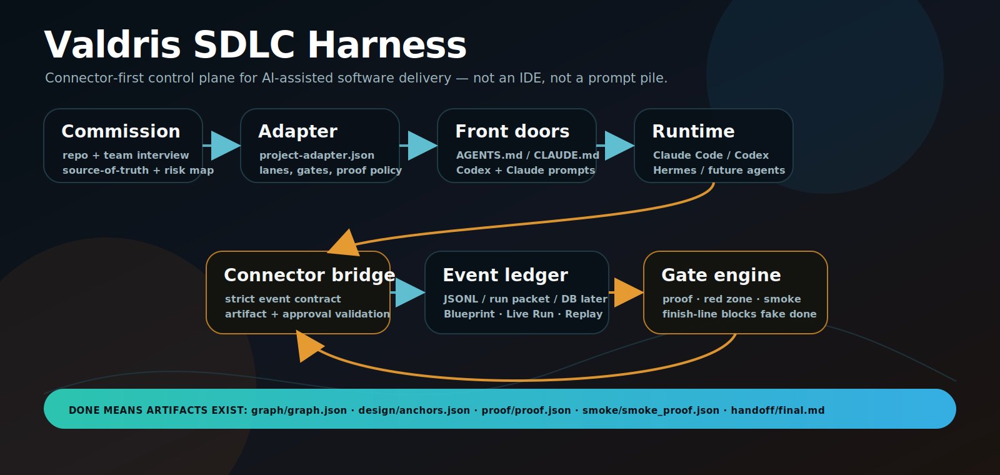
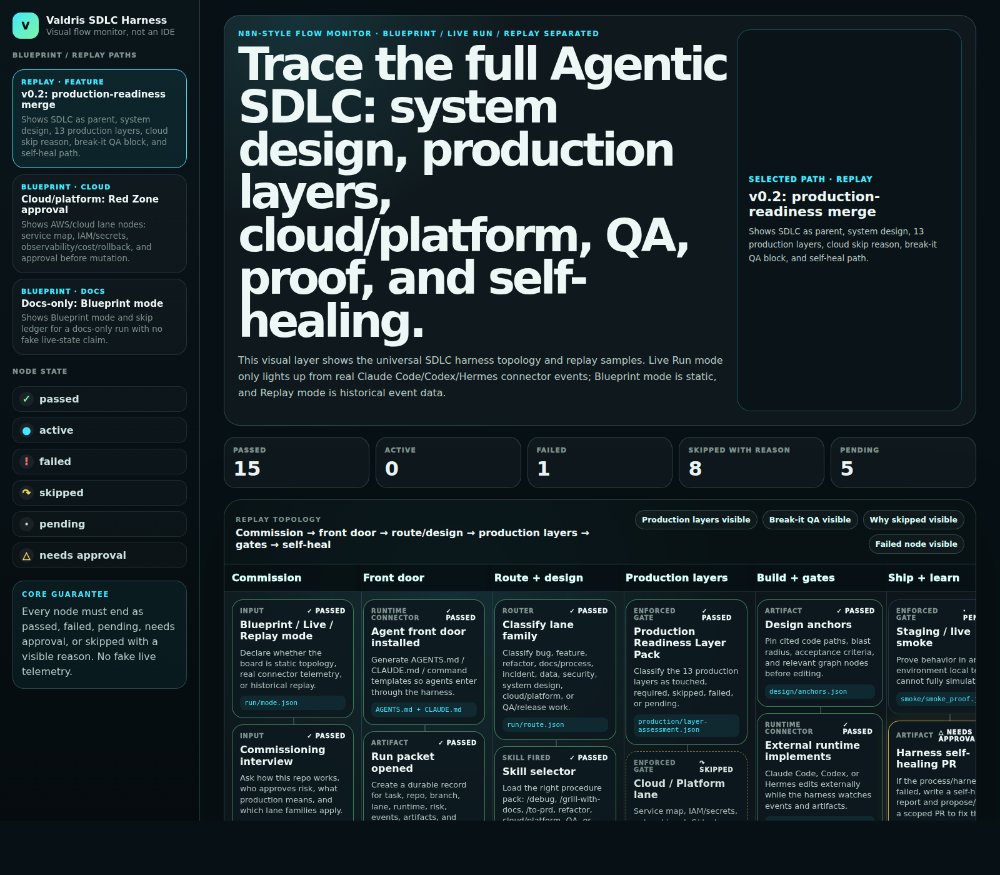
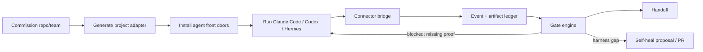
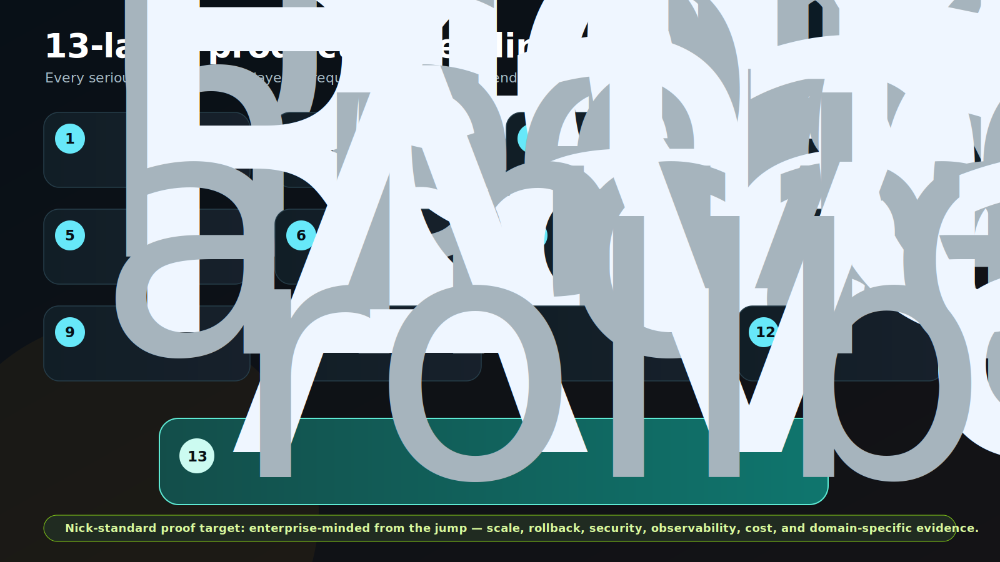
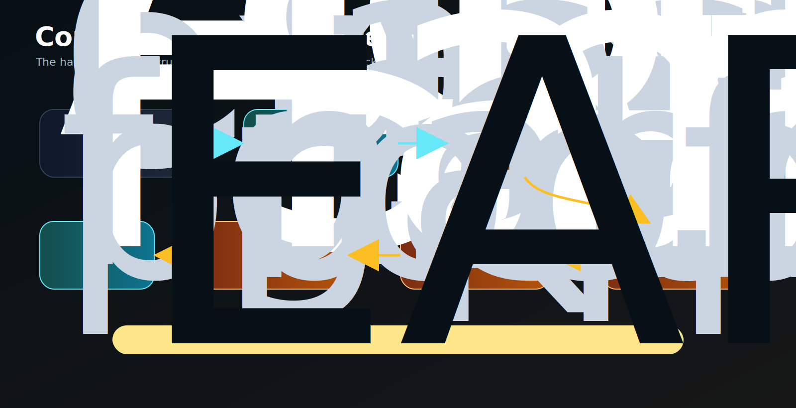

# Valdris SDLC Harness

**Valdris SDLC Harness** is a connector-first control plane for making real software repos AI-operable without turning the product into another IDE.

It commissions a repo/team, generates a project-specific harness pack, connects to Claude Code, Codex, Hermes, or future coding-agent runtimes, streams run events/artifacts, and blocks “done” until proof exists.



## What this is

This repo is the universal operating layer around AI coding agents:

```text
commission repo/team
→ generate project adapter
→ install AGENTS.md / CLAUDE.md / runtime prompts
→ run existing coding agents externally
→ stream events + artifacts through connector bridge
→ enforce proof / Red Zone / QA / smoke / self-heal gates
→ hand off with evidence paths
```

It is built for the shape Nick has been pushing toward:

- **not an IDE** — agents can keep working in Claude Code, Codex, Hermes, or another runtime;
- **not a prompt library** — prompts are front doors into a gated workflow;
- **not a fake dashboard** — live state requires real connector/API/CLI/watched-artifact events;
- **not small-app proof** — production work routes through a 13-layer full-stack readiness model;
- **not HumanLayer copy-paste** — clean-room, public-pattern-inspired control-plane primitives around our own SDLC harness model.

## Current product surface



The current app renders an operator dashboard / visual flow monitor with:

- Blueprint / Live Run / Replay mode separation;
- N8N-style SDLC swimlanes;
- visible Graphify/code-graph node;
- skill/gate/proof nodes;
- selected-node inspector;
- event stream;
- skip/fail ledger;
- proof/artifact language that makes fake completion visible.

## Why this exists

Coding agents are useful, but the failure mode is predictable:

> an agent gives a confident answer, says it “checked,” and skips the actual engineering flow.

The harness turns “I did it” into a verifiable run packet:

| Weak agent claim | Harness requirement |
|---|---|
| “I inspected the code” | Graph/code anchor artifact exists and cites real files |
| “I found the cause” | RCA artifact exists when debugging |
| “I built it” | implementation events + proof artifact exist |
| “It passed” | proof gate emits `proof/proof.json` |
| “No live smoke needed” | smoke node is skipped with an explicit reason |
| “Approval is fine” | Red Zone approval comes from human, never the agent |
| “Done” | finish-line gate confirms required artifacts passed/skipped |

## Core flow



## Canonical SDLC node chain

```text
intake
→ route
→ graphify
→ design-anchors
→ system-design
→ production-readiness
→ cloud-platform
→ implement
→ redzone
→ qa-break-it
→ prove
→ live-smoke
→ self-heal
→ handoff
```

These nodes are not just labels. Each node has an expected artifact path and connector event behavior.

| Node | Expected artifact |
|---|---|
| `intake` | `run/intake.json` |
| `route` | `run/route.json` |
| `graphify` | `graph/graph.json` |
| `design-anchors` | `design/anchors.json` |
| `system-design` | `design/system_design.md` |
| `production-readiness` | `production/layer-assessment.json` |
| `cloud-platform` | `cloud/service-map.json` or skip evidence |
| `implement` | `session/events.jsonl` |
| `redzone` | `approvals/redzone.json` |
| `qa-break-it` | `qa/break-it-results.md` |
| `prove` | `proof/proof.json` |
| `live-smoke` | `smoke/smoke_proof.json` or skip evidence |
| `self-heal` | `self_heal/self_heal_report.md` |
| `handoff` | `handoff/final.md` |

## 13-layer production readiness stack

For serious product work, “done” cannot mean “the page loaded once.” The harness includes a **13-layer production readiness pack** so production-impacting runs can mark each layer as required, passed, failed, pending, or skipped with a reason.



| # | Layer | What proof should cover |
|---:|---|---|
| 1 | Frontend | routes, UI behavior, browser/e2e proof, screenshots when useful |
| 2 | Backend / API / logic | request/response contracts, logs, error paths |
| 3 | Database / storage | migrations, integrity, rollback, sample data boundaries |
| 4 | Auth / permissions / RLS | positive/negative authorization, tenant/data boundaries |
| 5 | Hosting / deployment | preview/staging/prod URL, health, deployment logs |
| 6 | Cloud / compute | service map, IAM/secrets, topology, provider risk |
| 7 | CI/CD / version control | workflows, required checks, branch/promotion model |
| 8 | Security | secrets, threat surface, dependency/vulnerability posture |
| 9 | Rate limiting | abuse policy, quotas, burst/concurrency notes |
| 10 | Caching / CDN | cache behavior, invalidation, stale-data checks |
| 11 | Load balancing / scaling | capacity, failover, autoscaling/concurrency assumptions |
| 12 | Error tracking / logs / observability | logs, metrics, traces, alerts, dashboards/request IDs |
| 13 | Availability / recovery / DR | rollback, restore, graceful degradation, RTO/RPO |

The current repo has the layer pack, commissioning questions, adapter generation, and verifier coverage for the 13-layer structure. The next maturity jump is a full **enterprise proof-bank implementation** with domain packs, load gates, observability gates, eval gates, and domain-specific evidence templates.

## Connector + proof gate model



The local bridge is a v0 connector/runtime boundary. It is intentionally strict:

- validates event type, actor, status, run mode, and event source;
- rejects unknown node IDs;
- requires skip reasons for skipped nodes;
- requires failure reason + recovery path for failed nodes;
- verifies artifact files under the declared artifact root;
- blocks path escape / symlink escape;
- blocks agent-granted Red Zone approvals;
- blocks self-heal bypass when a harness gap is detected;
- blocks early `run.completed` until required artifacts are passed or explicitly skipped.

## Blueprint vs Live Run vs Replay

| Mode | Meaning | Allowed source |
|---|---|---|
| **Blueprint** | Static topology/schema/lane explanation | docs, schema, demo topology |
| **Live Run** | Current run state from real events | bridge, MCP, API, CLI emitter, watched artifacts |
| **Replay** | Historical run playback | JSONL, database, run packet |

Rule: **demo data must never pretend to be live telemetry.**

## What stays universal vs what becomes project-specific

| Universal piece | What stays in the core | What generated adapters customize |
|---|---|---|
| Commissioning interview | question groups, schema, generator | project/team answers |
| Agent front doors | AGENTS/CLAUDE/Codex prompt pattern | product name, repo paths, local laws |
| Router/lane pattern | work-type classification | enabled lanes and repo-specific procedures |
| SDLC node chain | canonical node IDs/artifacts | skip policies and required proof |
| Run packet model | events, artifacts, approvals, gates | issue IDs, branch names, owners |
| Proof gates | proof/red-zone/smoke/self-heal enforcement | actual validation commands |
| Graphify slot | code graph + design anchors | repo-specific graph paths and refresh command |
| Answer contract | bottom line, why, proof, fix, your call | tone and stakeholder style |

## Project commissioning output

`npm run commission` scans a target repo, merges human answers, and generates a project-specific harness pack:

```text
project-adapter.json
project.yaml
AGENTS.md
CLAUDE.md
.claude/commands/valdris-sdlc-harness.md
00_MAP.md
CONTEXT.md
docs/Validation Commands.md
docs/Codex Runtime Prompt.md
docs/Red Zone Rules.md
docs/Production Readiness Layers.md
docs/Cloud Platform Engineering.md
docs/QA and Live Smoke.md
docs/Self-Healing Loop.md
docs/Modes Blueprint Live Replay.md
runs/_run-template/README.md
commissioning-review.md
```

## Repository map

| Area | Purpose |
|---|---|
| `app/` | Next.js app routes and API surface |
| `components/` | visual monitor, control-plane shell, connector cards, flow views |
| `lib/` | workflow nodes, telemetry data, run/event models |
| `scripts/commission-harness.mjs` | project-adapter + harness-pack generator |
| `scripts/claude-code-bridge.mjs` | local event bridge and finish-line enforcement |
| `scripts/uash-emit-event.mjs` | CLI event emitter for runtimes |
| `scripts/verify-harness.mjs` | adversarial verifier for generator + bridge + gates |
| `scripts/graphify-scan.mjs` | local Graphify-compatible code graph generator |
| `scripts/graphify-gate.mjs` | graph schema/freshness gate |
| `scripts/anchor-gate.mjs` | design-anchor file citation gate |
| `docs/` | architecture, connector, production, QA, cloud, mode, lane docs |
| `templates/` | generated Claude Code and Codex front-door templates |
| `runs/` | example run packet/proof artifacts |
| `research/clean-room/` | public-source/clean-room product research and specs |

For a deeper generated map, see [`docs/HARNESS_REPO_MAP.md`](docs/HARNESS_REPO_MAP.md).

For lane-by-lane and repo-level Mermaid diagrams, see [`docs/REPO_MERMAID_MAPS.md`](docs/REPO_MERMAID_MAPS.md).

## Current implementation status

| Capability | Status | Evidence |
|---|---:|---|
| Next.js visual monitor | Built MVP | `app/`, `components/HarnessTelemetryApp.tsx` |
| Run queue/control-plane shell | Built MVP | `components/ControlPlaneApp.tsx`, `lib/control-plane.ts` |
| Blueprint / Live / Replay model | Built | docs + telemetry/event types |
| Graphify first-class node | Built + verified | `graphify`, `design-anchors`, `npm run graphify:*` |
| Commissioning generator | Built + verified | `scripts/commission-harness.mjs`, `verify:harness` |
| Generated agent front doors | Built + verified | `AGENTS.md`, `CLAUDE.md`, templates |
| Local connector bridge | Built + verified | `scripts/claude-code-bridge.mjs` |
| Strict event contract | Built + verified | `docs/CONNECTOR_EVENT_CONTRACT.md`, verifier |
| Artifact existence verification | Built + verified | bridge + adversarial verifier |
| Red Zone approval boundary | Built + verified | agent approval grants blocked |
| Self-heal bypass prevention | Built + verified | verifier blocks detected-gap bypass |
| 13 production layers | Built structurally | docs, adapter schema, verifier count |
| Cloud/platform lane | Built structurally | docs + node/artifact policy |
| QA/break-it/live smoke | Partial | docs + node/gate positions; deeper automation next |
| Enterprise load proof | Missing | future load/concurrency proof bank |
| Observability proof gate | Missing / policy-only | future logs/metrics/traces validator |
| AI/RAG eval gate | Missing | future eval artifact validator |
| Hosted multi-user backend | Future | local JSONL/run-packet first; DB later |

## Quick start

```bash
npm install
npm run typecheck
npm run build
npm run graphify:scan
npm run graphify:gate
npm run verify:harness
npm run dev
```

Open the app:

```text
http://127.0.0.1:3000
```

## Commission a target repo

```bash
npm run commission -- \
  --repo /path/to/repo \
  --project-name "Example" \
  --out ./generated-harness
```

Non-interactive/default answer mode:

```bash
npm run commission -- \
  --repo . \
  --project-name "Valdris SDLC Harness" \
  --out /tmp/valdris-commissioned \
  --yes
```

Print the commissioning question bank:

```bash
npm run commission:questions
```

## Simulate / connect runtime events

Start the local bridge:

```bash
npm run bridge:claude
```

Emit an event from another shell:

```bash
npm run bridge:emit -- RUN-123 node.entered intake "intake started" --status ok --actor codex
```

Run the verifier:

```bash
npm run verify:harness
```

The verifier spins up the bridge and tests negative cases like missing fields, fake artifacts, symlink/path escape, Red Zone bypass, self-heal bypass, and early completion.

## Design principles

1. **External runtimes stay external.** This is a control plane, not an IDE.
2. **Artifacts beat claims.** If the file does not exist, the gate did not run.
3. **Skipped is a state, not silence.** Skipped nodes require reasons.
4. **Graphify is first-class.** Code graph and design anchors belong in the main flow, not as a later add-on.
5. **Production readiness is full-stack.** Frontend-only proof is not enough for serious software.
6. **Live telemetry must be real.** Blueprint/demo/replay must be labeled.
7. **Self-heal the harness.** If a live run contradicts the harness docs/gates, propose or open a correction.

## Next build frontier

The current repo is a credible universal harness MVP. The next frontier is the **Enterprise Proof Bank + Domain Packs** layer:

```text
docs/ENTERPRISE_PROOF_BANK.md
docs/domain-packs/WEB_APP_ENTERPRISE.md
docs/domain-packs/GAME_DEVELOPMENT_ENTERPRISE.md
docs/domain-packs/WEBSITE_GROWTH_ENTERPRISE.md
scripts/load-gate.mjs
scripts/eval-gate.mjs
scripts/smoke-gate.mjs
scripts/observability-gate.mjs
lib/domain-packs.ts
UI proof-bank coverage panel
verify:harness negative tests for every new gate
```

That is the difference between “good local AI-agent workflow demo” and “enterprise-grade AI-operable engineering platform.”

## License

See [`LICENSE`](LICENSE).
