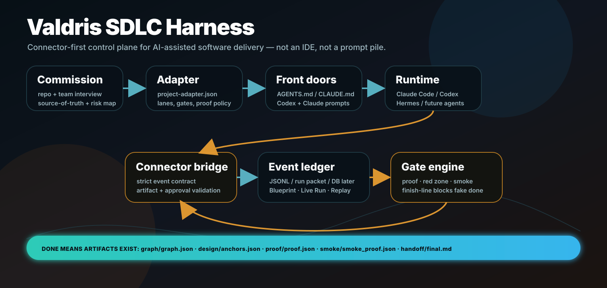

# Valdris SDLC Harness

> A proof-first control plane for AI coding agents.

Valdris helps AI coding agents work on real software projects. It gives each
agent a clear plan. It tracks the work. It also checks the proof before it lets
the agent say, “Done.”

Valdris works beside tools such as Claude Code, Codex, and Hermes. Those tools
still write the code. Valdris guides and checks the work around them.

It is not an IDE. It is not a coding agent. It is not a pile of prompts.



## Why Valdris exists

AI agents can move fast. They can also skip steps.

An agent may say it read the code when it did not. It may say a test passed
without showing the result. It may call a task done while a release, security,
or recovery check is still open.

Valdris turns those claims into checks.

| Agent says | Valdris asks for |
| --- | --- |
| “I read the code.” | A fresh code map and links to real files |
| “I fixed the bug.” | A root cause, the code change, and a passing test |
| “The build passed.” | A saved result tied to the right source commit |
| “We can ship.” | The required checks, proof, and human approval |
| “Done.” | A complete run packet with no hidden gaps |

## What Valdris does

Valdris follows six main steps:

1. **Commission the project.** Learn the repo, team rules, risks, and commands.
2. **Classify the request.** Decide what kind of work this is and how much proof
   it needs.
3. **Create a route and goal.** Pick one main workflow, set checkpoints, and set
   clear stop rules.
4. **Guide the agent.** Let an outside coding agent do the work in small steps.
5. **Check the evidence.** Run gates for tests, safety, review, and release.
6. **Hand off the result.** Show what changed, what passed, what was skipped, and
   what still needs a person.

The short version is:

```text
request
-> intake + classify
-> route (lane + skills)
-> Layer 0 foundation
-> goal loop through stages
-> 13 domains + packs as needed
-> gates + artifacts
-> evidence-backed handoff
```

## The Valdris model

These words have exact jobs in Valdris:

| Term | Plain meaning |
| --- | --- |
| **Route** | The locked plan for this request |
| **Lane** | The kind of work, such as a bug, feature, security review, or release |
| **Goal loop** | Check the goal, do a small step, test it, and repeat |
| **Stage** | One ordered part of the work |
| **Gate** | A rule that can stop the work |
| **Artifact** | A saved file that proves what happened |
| **Run packet** | The final set of facts, proof, reviews, and decisions |

The route is not free-form agent advice. It binds the request, risk level,
skills, controls, and source facts. Later findings may add stronger checks. They
may not quietly remove checks or lower the risk level.

### Layer 0 comes first

Layer 0 is the foundation check. It asks:

> Do we agree on what we are building, why it matters, and what “good” means?

It checks the product goal, requirements, test plan, system boundaries, data
rules, owners, and risks. Work that changes product code must pass this check
before the main build starts.

Layer 0 is not a fourteenth production domain.

### The 13 assurance domains

After Layer 0, Valdris checks the parts of a real production system that apply
to the request.

| # | Domain | Simple question |
| ---: | --- | --- |
| 1 | Frontend Experience | Does the user-facing part work? |
| 2 | Backend, API & Business Logic | Do the services and business rules work? |
| 3 | Data & Storage | Is the data correct, safe, and recoverable? |
| 4 | Identity, Authorization & Tenant Isolation | Can only the right people reach the right data? |
| 5 | Hosting & Deployment | Can we deploy it and check its health? |
| 6 | Cloud Infrastructure & Compute | Are the cloud services set up safely? |
| 7 | CI/CD, Version Control & Quality | Are changes tested and shipped in a repeatable way? |
| 8 | Security & Data Protection | Are secrets, packages, and trust limits safe? |
| 9 | Rate Limiting & Usage Control | Can the system control abuse and sudden traffic? |
| 10 | Caching & Content Delivery | Is cached data fast, correct, and fresh? |
| 11 | Scaling & Traffic Management | Can the system grow and handle failure? |
| 12 | Observability | Can the team see and explain problems? |
| 13 | Availability, Recovery & Operations | Can the team roll back, restore, and recover? |

A domain may pass, fail, stay open, or be skipped with a clear reason. Silence
is not a valid skip.

### Packs and cross-cutting work

Some needs touch many domains at once. Valdris treats them as packs or
cross-cutting concerns, not as new layers.

Examples include:

- AI models, prompts, agents, RAG, tools, and memory;
- async jobs, queues, and multi-agent work;
- SaaS and tenant isolation;
- iOS apps;
- real-time multiplayer systems;
- payments and digital commerce;
- youth AI safety.

This keeps the Layer 0 plus 13-domain model stable.

## Eight workflow skills

Valdris chooses one main skill for each phase. It may add up to four support
skills when the risk calls for them.

| Skill | Use it for |
| --- | --- |
| `valdris-intake-route` | A new, unclear, or mixed request |
| `valdris-bug-rca` | A bug, regression, slow system, or incident |
| `valdris-feature-delivery` | A feature or full-stack change |
| `valdris-architecture-refactor` | A design change, migration, or refactor |
| `valdris-security-audit` | Auth, privacy, security, or compliance |
| `valdris-platform-release` | Cloud, CI/CD, deploys, rollback, or recovery |
| `valdris-genai-assurance` | Models, prompts, RAG, agents, tools, or evals |
| `valdris-proof-handoff` | Final proof, release checks, and handoff |

The goal lives in a file, not only in chat. It stores checkpoints, limits, stop
rules, and the current source commit. A stale agent cannot silently replace a
newer checkpoint.

Read [Goal Loop and Skill Router](docs/GOAL_LOOP_AND_SKILL_ROUTER.md) for the
full contract.

## Three levels of proof

Valdris keeps three kinds of claims separate.

| Level | What it means |
| --- | --- |
| **Structural** | The right files, fields, paths, and digests exist |
| **Semantic** | The evidence proves the control’s real meaning |
| **Authoritative** | A trusted outside system or person signed the result |

A local JSON file can prove structure. It cannot turn itself into an App Store,
cloud provider, protected CI, or compliance receipt.

The current package is `0.9.0-rc.1`. Valdris has strong local structural gates.
It also supports semantic checks for a commissioned target. Authoritative
release stays blocked by default until a real target has trusted provider keys,
signed receipts, protected execution, and a rollback-safe head.

That limit is a safety feature. Valdris should never certify itself.

Read [v0.9 Authoritative Assurance](docs/V09_AUTHORITATIVE_ASSURANCE.md) for the
full trust model.

## Real run data only

The visualizer uses four clear labels:

| Mode | Meaning |
| --- | --- |
| **Blueprint** | A plan or static system map |
| **Live Run** | Real events from work happening now |
| **Replay** | Saved events from an older run |
| **Demo** | Sample data used to show the UI |

Demo data must never pretend to be live data. A live run needs real bridge, API,
CLI, MCP, or watched-file events.

## Quick start

This starts the local app and runs the main harness check.

```bash
git clone https://github.com/nickcarmonadigital/valdris-sdlc-harness.git
cd valdris-sdlc-harness
npm ci
npm run typecheck
npm run build
npm run verify:harness
npm run dev
```

Open:

```text
http://127.0.0.1:3000
```

This is a development check. It is not production release proof. Read
[`AGENTS.md`](AGENTS.md) before a merge or release.

## Commission a target repo

Commissioning makes a project pack at `<target>/.valdris-harness`.

```bash
npm run commission -- \
  --repo /path/to/repo \
  --project-name "Example" \
  --out /path/to/repo/.valdris-harness \
  --yes
```

The pack holds the project adapter, agent instructions, skills, controls, gates,
proof rules, and run templates. It also adds bounded front-door blocks to the
target’s `AGENTS.md` and `CLAUDE.md`.

Project facts stay in the generated adapter. The public Valdris core stays
generic.

Read [Universal Commissioning Flow](docs/UNIVERSAL_COMMISSIONING_FLOW.md) for
the full process.

## Route the first request

Run the router from this repo:

```bash
npm run route:request -- \
  --repo /path/to/repo \
  --profile enterprise \
  --actor "owner" \
  --request "Build a secure account settings page."
```

The router writes the intake, workload class, route, and starting goal. It does
not launch a coding agent or approve its own work. Claude Code, Codex, Hermes,
or another connected runtime performs the build.

## Safety rules

1. **Artifacts beat claims.** No proof file means no proof.
2. **Skipped is a real state.** Every skip needs a reason.
3. **Red Zone is human-only.** Agents cannot approve dangerous actions.
4. **Live means live.** Demo or static data cannot pose as a real run.
5. **Source identity matters.** Proof must match the right repo and commit.
6. **Reviews need separation.** The builder cannot be every reviewer.
7. **Stronger findings add checks.** They do not weaken the route.
8. **Outside authority stays outside.** Agents cannot create trusted receipts.

## What is built now

| Area | Status |
| --- | --- |
| Project commissioning and generated packs | Built and verified |
| Request routing and durable goal loop | Built and verified |
| Layer 0 and 13-domain assurance | Built and verified |
| Eight workflow skills | Built and verified |
| Code intelligence and source anchors | Built and verified |
| Proof, RCA, review, and run-packet gates | Built and verified |
| QA, break-it testing, and live smoke automation | Partial |
| AI assurance and initial domain packs | Built and verified |
| Privacy and clean-room checks | Built and verified |
| Local connector bridge | Built and verified |
| Web run visualizer | MVP |
| Semantic and authoritative assurance | Release candidate |
| Hosted multi-user service | Future |

The default trust store is empty. A green local run does not claim trusted
provider authority.

## Repository guide

| Path | What lives there |
| --- | --- |
| `app/` | Web pages and API routes |
| `components/` | Run visualizer and control-plane UI |
| `controls/` | Layer, AI, domain, trust, and policy catalogs |
| `docs/` | Full system and operating contracts |
| `knowledge/` | Small agent-facing knowledge map |
| `lib/` | App and bridge support code |
| `scripts/` | Gates, runners, generators, and verifiers |
| `skills/` | The eight Valdris workflow skills |
| `research/` | Source notes and clean-room research |

Start with:

1. [`AGENTS.md`](AGENTS.md) for repo rules.
2. [`knowledge/index.md`](knowledge/index.md) for the smallest useful source.
3. [Architecture](docs/ARCHITECTURE.md) for the system shape.
4. [Layer Zero and Assurance Taxonomy](docs/LAYER_ZERO_AND_ASSURANCE_TAXONOMY.md)
   for the assurance model.
5. [Connector Event Contract](docs/CONNECTOR_EVENT_CONTRACT.md) for live runs.

## Contributing

Read [`AGENTS.md`](AGENTS.md) before changing the harness.

For a normal code change, run at least:

```bash
npm run typecheck
npm run format:check
npm run build
npm run knowledge:gate
npm run skills:gate
npm run catalog:gate
npm run code-intelligence:scan
npm run code-intelligence:gate
npm run verify:harness
```

The full proof stack and release rules live in [`AGENTS.md`](AGENTS.md).

## License

[MIT](LICENSE)
