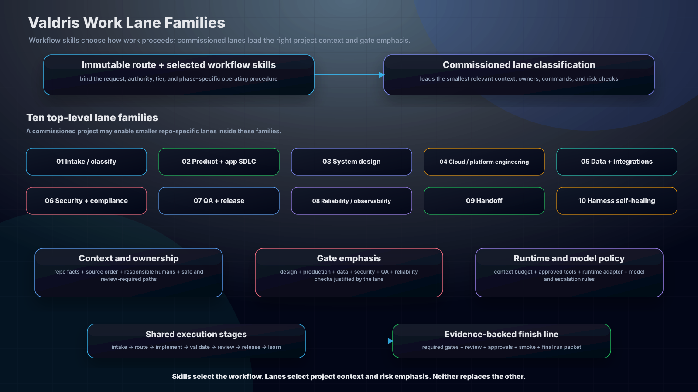
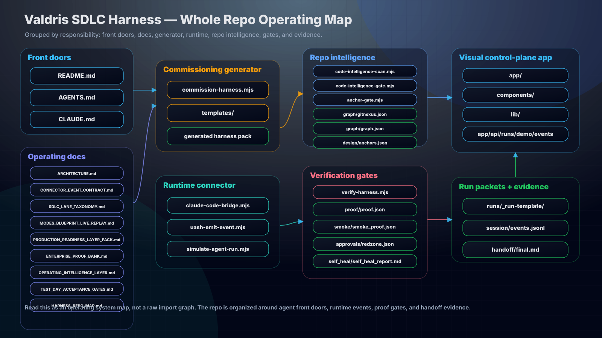
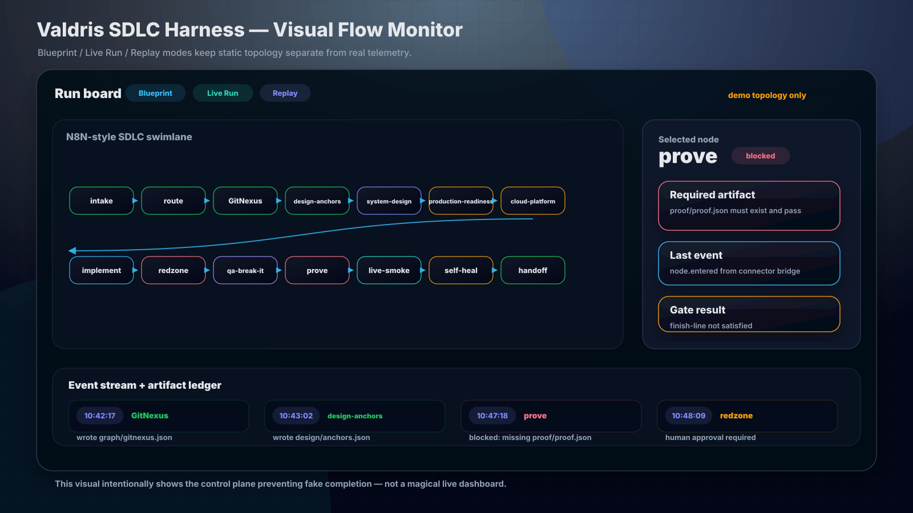
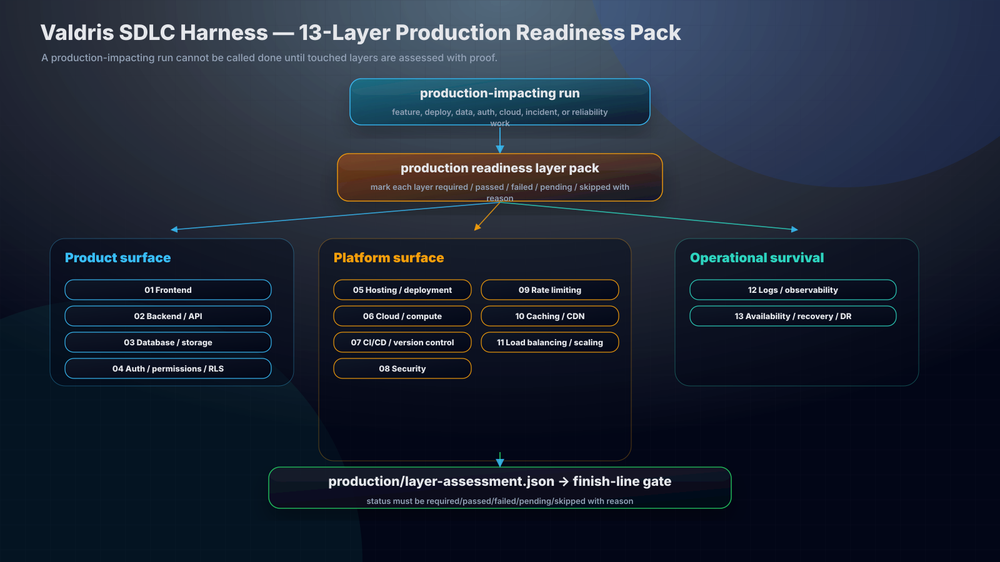
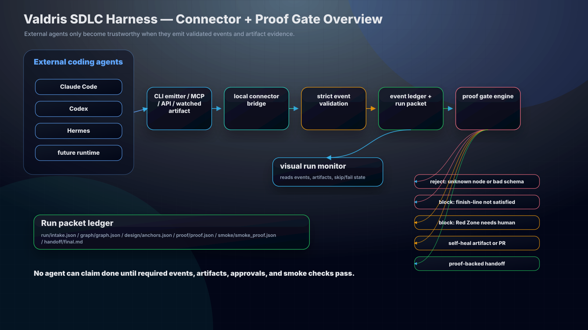
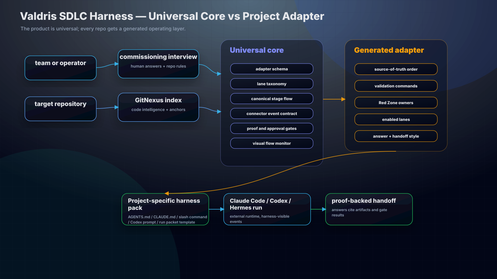
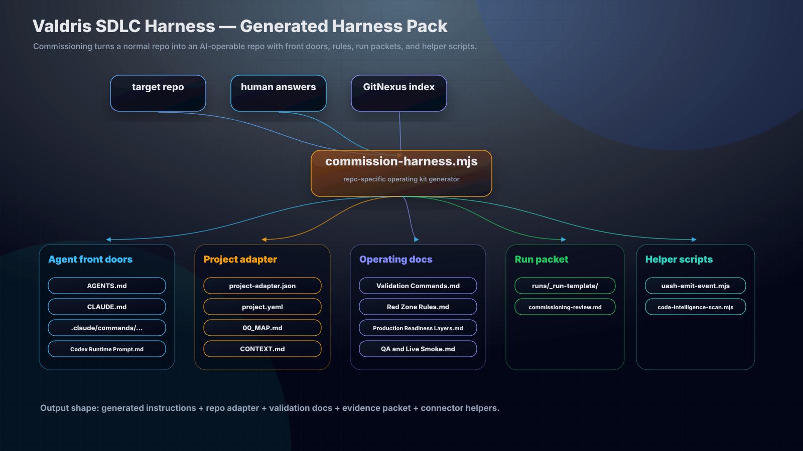

# Valdris SDLC Harness

**Valdris SDLC Harness** is a connector-first control plane for making real software repos AI-operable without turning the product into another IDE.

It commissions a repo/team, generates a project-specific harness pack, connects to Claude Code, Codex, Hermes, or future coding-agent runtimes, streams run events/artifacts, and blocks “done” until proof exists.

v0.8 adds a clean-room assurance import boundary, an integrity-locked public-source crosswalk, a cross-cutting async-workflow capability pack, Git/worktree-bound portable proof execution, required typed RCA for corrective-work routes, signed independent review, and coherent run-packet enforcement. It preserves the v0.7 goal/checkpoint loop, eight-skill router, typed enterprise controls, GenAI assurance, and domain packs.

The repo also includes an OKF/Obsidian-style agent knowledge vault under `knowledge/`. Treat `knowledge/index.md` as the low-token navigation layer before opening deeper docs.

Every new run now begins with executable **Layer 0** assurance inside the stable `route` stage: `run/workload-classification.json` classifies workload tier and profiles, and `foundation/assessment.json` proves the Foundation / Good Looks Like controls before implementation and the 13 production-readiness domains. Async and multi-agent orchestration remain cross-cutting execution concerns governed by the applicable foundation, production, AI, trajectory, authority, and proof gates; they are not additional production domains.

## Start here: the visible lane map



This is the primary README visual. It shows how work enters the harness, gets routed into lanes, passes through shared stages, fires gates, and produces proof artifacts.

## What the lane map means

The harness is easiest to understand as **lanes → stages → gates → artifacts**.

- **Lanes** decide what kind of work this is: engineering, cloud, security, incident, QA, agent-runtime, support, etc.
- **Stages** move the work through intake, route, graph scan, design, implementation, validation, and handoff.
- **Gates** block fake completion: provenance, neutrality, privacy, schema compatibility, conditional RCA, GitNexus/code-intelligence + anchor, Red Zone approval, portable proof, independent review, run-packet coherence, live smoke, finish-line, and self-heal. RCA is mandatory for bugs (including regressions), incidents, and self-heal corrective work.
- **Artifacts** prove the gate ran: `graph/graph.json`, `design/anchors.json`, `proof/portable.json`, `rca/rca.json`, `review/review.json`, `run/packet.json`, `smoke/smoke_proof.json`, and `handoff/final.md`.

### Core lane families

1. **Intake / classify** — capture the ask, affected users, repo, risk, and work type.
2. **Product + app SDLC** — bug fixes, features, refactors, frontend/backend/product work.
3. **System design** — architecture, APIs, scale, data models, tradeoffs, ADRs.
4. **Cloud / platform engineering** — cloud providers, hosting, IAM, secrets, deployment, and runtime infrastructure.
5. **Data + integrations** — DB, migrations, webhooks, queues, providers, sync paths.
6. **Security + compliance** — auth, permissions, RLS, secrets, tenant boundaries.
7. **QA + release** — acceptance, break-it QA, regression, smoke, release proof.
8. **Reliability / observability** — logs, metrics, traces, alerts, rollback, incidents.
9. **Handoff** — answer contract, proof paths, decision packet, next call.
10. **Harness self-healing** — if the process failed, create a correction artifact/PR.

### Layer 0 before the 13 production domains

Layer 0 is the executable foundation gate, not a new connector node and not a fourteenth production domain:

```text
intake
-> route: workload classification (`uash.workload-classification.v1`)
-> Layer 0: foundation assessment (`uash.foundation-assessment.v1`)
-> 13 production-readiness domains
-> implementation and proof
```

New routes use `uash.route.v2` and digest-bind `run/workload-classification.json`. The catalog at `controls/workload-taxonomy.v1.json` recognizes SaaS, AI/agentic, mobile, regulated, payments, and realtime profiles; it can activate the SaaS, mobile-iOS, realtime multiplayer, digital-commerce, and youth-AI domain packs. The Foundation / Good Looks Like catalog at `controls/foundation-layer.v1.json` establishes product/domain intent, requirements and acceptance, quality attributes, architecture boundaries, data/transaction semantics, engineering/test strategy, and decision ownership before downstream proof is accepted.

See **[Layer Zero and Assurance Taxonomy](docs/LAYER_ZERO_AND_ASSURANCE_TAXONOMY.md)** for the formal distinction between the prerequisite foundation, the thirteen shared production-assurance domains, workload profiles, domain packs, cross-cutting concerns, and proof strength.

See **[Production Assurance Gap Register](docs/PRODUCTION_ASSURANCE_GAP_REGISTER.md)** for the remaining boundary between structural gate conformance and provider-backed semantic assurance. The harness does not hide those conditions behind a green local JSON packet.

### Visual maps

The diagrams below are purpose-built README visuals, rendered as deterministic SVGs so the repo shows the architecture directly instead of hiding the useful map behind a link.



More maps:

- **[Repo Mermaid Maps](docs/REPO_MERMAID_MAPS.md)** — rendered diagrams plus Mermaid source for the repo map, lane map, connector flow, 13-layer pack, and generated harness pack.
- **[Generated Repo Map](docs/HARNESS_REPO_MAP.md)** — file-by-file responsibility map generated from the current repo.

## What this is

This repo is the universal operating layer around AI coding agents:

```text
commission repo/team
→ generate project adapter
→ install AGENTS.md / CLAUDE.md / runtime prompts
→ run existing coding agents externally
→ stream events + artifacts through connector bridge
→ enforce proof / Red Zone / QA / smoke / self-heal gates
→ hand off with evidence paths
```

It is built for the operating shape the project requires:

- **not an IDE** — agents can keep working in Claude Code, Codex, Hermes, or another runtime;
- **not a prompt library** — prompts are front doors into a gated workflow;
- **not a fake dashboard** — live state requires real connector/API/CLI/watched-artifact events;
- **not small-app proof** — production work routes through a 13-layer full-stack readiness model;
- **not HumanLayer copy-paste** — clean-room, public-pattern-inspired control-plane primitives around our own SDLC harness model.

## Current product surface



The current app renders an operator dashboard / visual flow monitor with:

- Blueprint / Live Run / Replay mode separation;
- N8N-style SDLC swimlanes;
- visible GitNexus/code-intelligence node;
- skill/gate/proof nodes;
- selected-node inspector;
- event stream;
- skip/fail ledger;
- proof/artifact language that makes fake completion visible.

## Why this exists

Coding agents are useful, but the failure mode is predictable:

> an agent gives a confident answer, says it “checked,” and skips the actual engineering flow.

The harness turns “I did it” into a verifiable run packet:

| Weak agent claim | Harness requirement |
|---|---|
| “I inspected the code” | GitNexus/code-intelligence evidence + graph/code anchor artifacts exist and cite real files |
| “I found the cause and fixed it” | For bugs (including regressions), incidents, and self-heal corrective work, typed RCA runs the same regression command against distinct real pre-fix/post-fix commits and binds the failure signature, source change, fix, and passing post-fix proof |
| “I built it” | implementation events + proof artifact exist |
| “It passed” | proof gate emits `proof/proof.json` |
| “No live smoke needed” | smoke node is skipped with an explicit reason |
| “Approval is fine” | Red Zone approval comes from human, never the agent |
| “Done” | finish-line gate confirms required artifacts passed/skipped |

## Core flow

```text
commission repo/team
→ generate project adapter
→ install agent front doors
→ run Claude Code / Codex / Hermes externally
→ stream events + artifacts through connector bridge
→ enforce gate engine
→ handoff

Blocked paths:
- missing proof → return to runtime work
- harness gap → self-heal proposal / PR
```

See the rendered flow diagrams in [`docs/REPO_MERMAID_MAPS.md`](docs/REPO_MERMAID_MAPS.md).

## Canonical SDLC node chain

```text
intake
→ route
→ code-intelligence
→ design-anchors
→ system-design
→ production-readiness
→ cloud-platform
→ implement
→ redzone
→ qa-break-it
→ prove
→ live-smoke
→ self-heal
→ handoff
```

These nodes are not just labels. Each node has an expected artifact path and connector event behavior.

| Node | Expected artifact |
|---|---|
| `intake` | `run/intake.json` |
| `route` | `run/route.json` |
| `code-intelligence` | `graph/graph.json` |
| `design-anchors` | `design/anchors.json` |
| `system-design` | `design/system_design.md` |
| `production-readiness` | `production/layer-assessment.json` |
| `cloud-platform` | `cloud/service-map.json` or skip evidence |
| `implement` | `session/events.jsonl` |
| `redzone` | `approvals/redzone.json` |
| `qa-break-it` | `qa/break-it-results.md` |
| `prove` | `proof/proof.json` |
| `live-smoke` | `smoke/smoke_proof.json` or skip evidence |
| `self-heal` | `self_heal/self_heal_report.md` |
| `handoff` | `handoff/final.md` |

## GitNexus-backed code intelligence

The `code-intelligence` node now uses **GitNexus as the preferred code-intelligence backend**. The harness does **not** vendor GitNexus; it invokes the external CLI in index-only mode and writes an evidence artifact.

```bash
npm run code-intelligence:scan
npm run code-intelligence:gate
```

That produces:

- `graph/gitnexus.json` — GitNexus index evidence, package/license boundary, command output, and status.
- `graph/graph.json` — stable Valdris graph artifact consumed by the harness.
- `graph/freshness.json` — commit/freshness proof.
- `design/anchors.json` — file anchors for design and blast-radius reasoning.

If GitNexus is unavailable, the scanner may fall back to the local static graph, but the run must disclose that fallback and must not claim GitNexus-backed analysis. Use `npm run code-intelligence:scan:strict` when a run must fail instead of falling back.

## 13-layer production readiness stack

The 13 domains begin only after Layer 0 workload classification and foundation assurance have resolved. Layer 0 defines what is being built and what good looks like; the production pack then proves how that workload operates safely. Async orchestration cuts across both layers and does not change the canonical domain count.

For serious product work, “done” cannot mean “the page loaded once.” The harness includes a **13-layer production readiness pack** so production-impacting runs can mark each layer as required, passed, failed, pending, or skipped with a reason.



| # | Layer | What proof should cover |
|---:|---|---|
| 1 | Frontend | routes, UI behavior, browser/e2e proof, screenshots when useful |
| 2 | Backend / API / logic | request/response contracts, logs, error paths |
| 3 | Database / storage | migrations, integrity, rollback, sample data boundaries |
| 4 | Auth / permissions / RLS | positive/negative authorization, tenant/data boundaries |
| 5 | Hosting / deployment | preview/staging/prod URL, health, deployment logs |
| 6 | Cloud / compute | service map, IAM/secrets, topology, provider risk |
| 7 | CI/CD / version control | workflows, required checks, branch/promotion model |
| 8 | Security | secrets, threat surface, dependency/vulnerability posture |
| 9 | Rate limiting | abuse policy, quotas, burst/concurrency notes |
| 10 | Caching / CDN | cache behavior, invalidation, stale-data checks |
| 11 | Load balancing / scaling | capacity, failover, autoscaling/concurrency assumptions |
| 12 | Error tracking / logs / observability | logs, metrics, traces, alerts, dashboards/request IDs |
| 13 | Availability / recovery / DR | rollback, restore, graceful degradation, RTO/RPO |

The current repo has 39 named controls across the thirteen layers. `uash.production-readiness.v2` rejects evidence-shaped prose: paths must resolve, enterprise artifacts must match hashes/commit/environment, metrics must satisfy their thresholds, command results need output digests, and approvals must name a human. Five domain packs add SaaS, iOS, realtime multiplayer, digital-commerce, and youth-AI requirements without bloating the universal layer model.

## Can this drive a full-stack iOS game build?

Yes—within real platform and authority boundaries. Route the request through intake, then use feature delivery as the primary skill with platform/release, security, GenAI (when applicable), and final proof as phased support. The goal can cover the Swift/iOS client, authoritative backend, accounts, purchases, cloud saves, matchmaking, AI behavior, deployment, observability, recovery, and TestFlight smoke.

On Windows, Valdris can commission, design, implement source/backend work, run non-Apple gates, and manage the loop. A signed iOS archive, simulator/device tests, and TestFlight upload still require an authorized macOS/Xcode runner, Apple credentials, and human approval. Those stopping conditions remain open until real evidence arrives. See [`docs/GOAL_LOOP_AND_SKILL_ROUTER.md`](docs/GOAL_LOOP_AND_SKILL_ROUTER.md).

The local validators verify shape, subject binding, paths, digests, timestamps, target IDs, and declared trust metadata; they do not cryptographically authenticate a self-authored CI/provider receipt. Native test, archive, distribution, and TestFlight smoke evidence must share the commissioned scheme, bundle/team reference, adapter digest, and immutable build ID. A real release must still import receipts or signed attestations from protected CI/App Store Connect and use token-gated bridge approvals. Valdris orchestrates and rejects missing proof; it is not the Apple build service or a certification authority.

Start the executable route and active goal from the target repo:

```bash
node .valdris-harness/scripts/route-request.mjs --repo . --profile enterprise --actor "operator" --request "Build a multiplayer iOS game with an AI dungeon master, accounts, purchases, cloud saves, matchmaking, and ship it to TestFlight."
```

The deterministic router writes the intake/classification/route/goal starting point; it does not launch Codex or certify its own output. Validate the active start in order with `intake-gate.mjs`, `workload-classification-gate.mjs`, `route-gate.mjs`, `foundation-gate.mjs` when required, and `goal-gate.mjs --allow-active`. The selected external coding runtime then executes the engineering checkpoints under the bridge-enforced finish line.

## Connector + proof gate model



The local bridge is a v0 connector/runtime boundary. It is intentionally strict:

- validates event type, actor, status, run mode, and event source;
- safely loads `project-adapter.json` to apply required-node/artifact policy;
- rejects unknown node IDs;
- requires skip reasons for skipped nodes;
- requires failure reason + recovery path for failed nodes;
- verifies artifact files under the declared artifact root;
- validates `proof/proof.json` content against `uash.proof.v1`;
- blocks path escape / symlink escape;
- blocks agent-granted or tokenless Red Zone approvals;
- blocks self-heal bypass when a harness gap is detected;
- blocks early `run.completed` until required artifacts are passed or explicitly skipped.

## Blueprint vs Live Run vs Replay

| Mode | Meaning | Allowed source |
|---|---|---|
| **Blueprint** | Static topology/schema/lane explanation | docs, schema, demo topology |
| **Live Run** | Current run state from real events | bridge, MCP, API, CLI emitter, watched artifacts |
| **Replay** | Historical run playback | JSONL, database, run packet |

Rule: **Demo data must be labeled Demo and must never pretend to be Live Run or historical Replay telemetry.**

## What stays universal vs what becomes project-specific



| Universal piece | What stays in the core | What generated adapters customize |
|---|---|---|
| Commissioning interview | question groups, schema, generator | project/team answers |
| Agent front doors | AGENTS/CLAUDE/Codex prompt pattern | product name, repo paths, local laws |
| Router/lane pattern | work-type classification | enabled lanes and repo-specific procedures |
| SDLC node chain | canonical node IDs/artifacts | skip policies and required proof |
| Run packet model | events, artifacts, approvals, gates | issue IDs, branch names, owners |
| Proof gates | proof/red-zone/smoke/self-heal enforcement | actual validation commands |
| Code Intelligence slot | GitNexus-backed code intelligence + graph/code anchors | repo-specific graph paths, index alias, and fallback policy |
| Answer contract | bottom line, why, proof, fix, your call | tone and stakeholder style |

## Project commissioning output



`npm run commission` scans a target repo, merges human answers, and generates a project-specific harness pack at the one supported v0.8 location: `<target>/.valdris-harness`. The complete pack must be committed in the target's Git worktree before portable proof, signed review, or run-packet creation.

```text
project-adapter.json
project.yaml
AGENTS.md
CLAUDE.md
.claude/commands/valdris-sdlc-harness.md
.agents/skills/<eight Valdris skills>
.claude/skills/<eight Valdris skills>
skills/codex-routing.yaml
skills/registry.json
controls/workload-taxonomy.v1.json
controls/foundation-layer.v1.json
controls/production-layers.v2.json
controls/genai-assurance.v1.json
controls/domain-packs/*.json
.github/workflows/valdris-assurance.yml
package.json
knowledge/index.md
00_MAP.md
CONTEXT.md
docs/Validation Commands.md
docs/Proof Schema.md
docs/Codex Runtime Prompt.md
docs/Red Zone Rules.md
docs/Production Readiness Layers.md
docs/Cloud Platform Engineering.md
docs/QA and Live Smoke.md
docs/Self-Healing Loop.md
docs/Modes Blueprint Live Replay.md
docs/Good Looks Like Foundation.md
docs/Code Quality Guardrails.md
docs/Enterprise Proof Bank.md
docs/Operating Intelligence Layer.md
docs/Team Harness Registry.md
docs/Human Agent Protocol.md
docs/Agent Knowledge Vault.md
runs/_run-template/README.md
scripts/uash-emit-event.mjs
scripts/uash-write-proof.mjs
scripts/code-intelligence-scan.mjs
scripts/code-intelligence-local-scan.mjs
scripts/code-intelligence-gate.mjs
scripts/anchor-gate.mjs
scripts/code-intelligence-gate-all.mjs
scripts/intake-gate.mjs
scripts/workload-classifier-lib.mjs
scripts/workload-classification-gate.mjs
scripts/foundation-gate.mjs
scripts/route-request.mjs
scripts/route-gate.mjs
scripts/control-gate-lib.mjs
scripts/production-layer-gate.mjs
scripts/ai-assurance-gate.mjs
scripts/domain-assurance-gate.mjs
scripts/goal-gate.mjs
scripts/goal-transition.mjs
scripts/context-manifest-gate.mjs
scripts/eval-gate.mjs
scripts/trajectory-gate.mjs
scripts/waiver-gate.mjs
scripts/skill-registry-gate.mjs
scripts/enterprise-ai-gate-all.mjs
scripts/okf-vault-gate.mjs
commissioning-review.md
```

## Repository map

| Area | Purpose |
|---|---|
| `app/` | Next.js app routes and API surface |
| `components/` | visual monitor, control-plane shell, connector cards, flow views |
| `lib/` | workflow nodes, telemetry data, run/event models |
| `knowledge/` | OKF-style agent vault: progressive indexes, playbooks, concepts, and source notes |
| `scripts/commission-harness.mjs` | project-adapter + harness-pack generator |
| `scripts/claude-code-bridge.mjs` | local event bridge and finish-line enforcement |
| `scripts/uash-emit-event.mjs` | CLI event emitter for runtimes |
| `scripts/verify-harness.mjs` | adversarial verifier for generator + bridge + gates |
| `scripts/code-intelligence-scan.mjs` | GitNexus-backed scan wrapper; writes GitNexus evidence and stable graph artifacts |
| `scripts/code-intelligence-local-scan.mjs` | local Code-intelligence-compatible graph generator / fallback artifact writer |
| `scripts/code-intelligence-gate.mjs` | graph schema/freshness gate |
| `scripts/code-intelligence-gate-all.mjs` | combined graph and anchor gate wrapper |
| `scripts/workload-classification-gate.mjs` | route-stage workload tier/profile classifier gate for `uash.route.v2` |
| `scripts/foundation-gate.mjs` | executable Layer 0 Foundation / Good Looks Like assessment gate |
| `scripts/production-layer-gate.mjs` | 13-layer production readiness validator |
| `scripts/enterprise-ai-gate-all.mjs` | current-run aggregate intake/route/goal/context/production/AI/domain/eval/trajectory/waiver finish line |
| `controls/` | workload taxonomy, Layer 0 foundation, production, AI, SaaS, iOS, realtime, commerce, and youth-safety catalogs |
| `skills/` | eight phase-aware Valdris workflow skills, Codex YAML routing projection, and proof-gate registry |
| `scripts/okf-vault-gate.mjs` | OKF-style knowledge vault validator |
| `scripts/anchor-gate.mjs` | design-anchor file citation gate |
| `docs/ENTERPRISE_PROOF_BANK.md` | enterprise/domain proof-bank standard |
| `docs/OPERATING_INTELLIGENCE_LAYER.md` | evals, trajectory, context, skills, memory, tools, sandbox, model routing, economics, MCP/A2A, lifecycle |
| `docs/TEST_DAY_ACCEPTANCE_GATES.md` | acceptance gates for proving the harness update itself |
| `docs/` | architecture, connector, production, QA, cloud, mode, lane docs |
| `templates/` | generated Claude Code and Codex front-door templates |
| `runs/_run-template/` | project-neutral run packet contract; real operational runs stay outside the public harness |
| `research/clean-room/` | public-source/clean-room product research and specs |

For a deeper generated map, see [`docs/HARNESS_REPO_MAP.md`](docs/HARNESS_REPO_MAP.md).

For lane-by-lane and repo-level Mermaid diagrams, see [`docs/REPO_MERMAID_MAPS.md`](docs/REPO_MERMAID_MAPS.md).

## v0.8 clean-room assurance and portable proof

- offline provenance verification for the allowlisted public assurance kernel;
- project-neutrality, recursive privacy, and schema-compatibility gates for the canonical tree, release artifacts, and newly generated commissioned packs;
- an explicit public-source-to-Valdris crosswalk that preserves Layer 0 plus the thirteen production-assurance domains;
- asynchronous workflows as a cross-cutting capability pack, with an adversarial rejection test for `layer-14`;
- cross-platform proof execution with argv-safe process spawning, Windows npm/pnpm/yarn shim resolution without `shell:true`, bounded output, timeouts, repetition, red-baseline support, local-path/secret redaction, exact Git HEAD, worktree, validator, and artifact-aware application-source bindings;
- required typed RCA for bugs (including regressions), incidents, and self-heal corrective work, with one command identity across distinct real pre-fix/post-fix commits, a declared failure signature, and root-cause/fix paths verified against the real source diff;
- Ed25519-attested independent review using project-owned public keys in `.valdris-harness/controls/review-trust.v1.json`; the signature binds the full pre-review input/evidence bundle, validator runtime, scheme, and key identity before native-validator-bound final packet creation;
- Linux and Windows CI plus a full-history secret scan.

The clean-room privacy gate walks the canonical harness tree or generated `.valdris-harness` pack recursively and fails closed on binary files unless a shipped public asset matches an approved path and SHA-256. It is not a universal product-asset policy: commissioned product binaries remain governed by that target's asset, privacy, security, and supply-chain rules. After code-intelligence generation, CI runs the same detector only over `graph/` and `design/anchors.json` with explicit `--include` scopes. The clean-room guarantee covers the current canonical tree, release artifacts made from it, and newly generated commissioned packs. A normal PR does not purge earlier public Git objects: older commits may retain content removed from the current tree, and the full-history secret scan detects supported findings without deleting them. History rewriting is a separate destructive operation; [ADR-0001](docs/decisions/ADR-0001-public-history-retention.md) records the owner decision to retain that pre-existing public history for this non-destructive merge without claiming it was purged.

See [Private Work Harness Import Decision](docs/import/PRIVATE_WORK_HARNESS_IMPORT_DECISION.md) and [Clean-room Assurance Import](knowledge/playbooks/clean-room-assurance-import.md).

## v0.7 enterprise + AI goal-loop assurance

- eight repo-native skills with phased intake, delivery, and proof ownership;
- durable goals, stopping conditions, checkpoints, and cost/tool/token/time budgets;
- hashed context manifests that reject secret-like inputs and path escapes;
- control-level production proof across all thirteen layers;
- AI inventory, eval, safety, RAG, tool, memory, observability, cost, and lifecycle controls;
- SaaS, iOS, multiplayer, commerce, and youth-AI domain packs;
- adversarial fixtures for fabricated evidence, failing metrics/evals, self-approval, budget overrun, secret context, and registry escape.

Research and primary-source crosswalks live under [`research/enterprise-ai-2026/`](research/enterprise-ai-2026/).

## v0.6 trust-boundary hardening

The Fable Phase 1 audit remediation is now part of the main harness contract:

- dependencies are pinned;
- GitHub Actions CI runs the harness gates;
- proof artifacts validate as `uash.proof.v1`;
- the bridge consumes adapter runtime policy;
- human approval grants require a token and never persist the raw token;
- bundled UI seed data is labeled Demo, not Replay.

See [`docs/TRUST_BOUNDARY_HARDENING_V06.md`](docs/TRUST_BOUNDARY_HARDENING_V06.md) and [`docs/PROOF_SCHEMA.md`](docs/PROOF_SCHEMA.md).

## Current implementation status

| Capability | Status | Evidence |
|---|---:|---|
| Next.js visual monitor | Built MVP | `app/`, `components/HarnessTelemetryApp.tsx` |
| Run queue/control-plane shell | Built MVP | `components/ControlPlaneApp.tsx`, `lib/control-plane.ts` |
| Blueprint / Demo / Live / Replay truth model | Built + verified | bundled seed data is Demo; Live requires connector events; Replay is historical run data |
| GitNexus/code-intelligence node | Built + verified | `code-intelligence`, `design-anchors`, `npm run code-intelligence:*`; GitNexus indexed + local stable projection unless a direct GitNexus exporter is added |
| Commissioning generator | Built + verified | `scripts/commission-harness.mjs`, `verify:harness`; 31 groups / 158 questions |
| Generated agent front doors | Built + verified | `AGENTS.md`, `CLAUDE.md`, templates |
| Good-looks-like foundation docs | Built structurally | generated `Good Looks Like Foundation`, `Code Quality Guardrails`, `Enterprise Proof Bank` docs |
| Workload taxonomy classification | Built + gated | `uash.workload-classification.v1`, `controls/workload-taxonomy.v1.json`, route v2 digest binding |
| Layer 0 foundation assurance | Built + gated | `foundation/assessment.json`, `controls/foundation-layer.v1.json`, `foundation-gate.mjs` |
| Goal/checkpoint loop + skill router | Built + verified | `goal-gate.mjs`, YAML-frontmatter discovery, `skills/codex-routing.yaml`, `skills/registry.json`, eight Valdris workflows, forward tests |
| Clean-room import boundary | Built + adversarially verified | `provenance-gate.mjs`, `neutrality-gate.mjs`, `privacy-gate.mjs`, `schema-compat-gate.mjs` |
| Assurance execution overlay | Built + integrity locked | public-source crosswalk, execution policy, async-workflows capability pack, catalog hashes |
| Portable proof, conditional RCA, review, and run packet | Built + adversarially verified | `proof-runner.mjs`, `rca-gate.mjs`, `review-gate.mjs`, `run-packet-gate.mjs`, focused verifiers; proof binds Git/worktree/application/validator state, review signs the complete evidence bundle, and RCA is mandatory for bugs/regressions, incidents, and self-heal corrective work |
| Operating-intelligence enforcement core | Built + verified | executable goal, eval, trajectory, context, skill, production, AI/domain, smoke, waiver, and typed-evidence gates |
| Extended operating-intelligence policy | Commissioned, not a runtime | memory, tool hooks, sandbox management, model routing, economics, background PR agents, MCP/A2A, and agent lifecycle are captured as policy fields/docs for external runtimes and providers |
| Enterprise proof-bank map | Built + executable controls | 39 controls, typed evidence, dependency DAG, `production-layer-gate.mjs` |
| Test-day acceptance gates | Built structurally | `docs/TEST_DAY_ACCEPTANCE_GATES.md`, verifier command set |
| Local connector bridge | Built + verified | `scripts/claude-code-bridge.mjs`; adapter-aware v0.6 trust boundary |
| Strict event contract | Built + verified | `docs/CONNECTOR_EVENT_CONTRACT.md`, verifier, CI |
| Artifact content verification | Built + verified | `uash.proof.v1` schema validation + bridge + adversarial verifier |
| Red Zone approval boundary | Built + verified | actor-human + pending approval + token gate; raw tokens not persisted |
| Self-heal bypass prevention | Built + verified | verifier blocks detected-gap bypass |
| 13 production layers | Built + adversarially verified | v2 control catalog, typed evidence, dependency DAG, bridge compatibility, negative tests |
| Generative AI assurance | Built + adversarially verified | 10 control domains, conditional RAG/tools/memory, eval and trajectory gates |
| Domain assurance packs | Built initial set | SaaS, mobile iOS, multiplayer realtime, digital commerce, youth AI safety |
| Agent knowledge vault | Built + verified | `knowledge/index.md`, `scripts/okf-vault-gate.mjs`, `npm run knowledge:gate` |
| Cloud/platform lane | Built structurally | docs + node/artifact policy |
| CI enforcement | Built + verified | `.github/workflows/ci.yml` runs the harness gates automatically |
| QA/break-it/live smoke | Partial | docs + node/gate positions; deeper automation next |
| Enterprise load proof | Partial / policy-only | proof-bank standard exists; executable load gate is next |
| Observability proof gate | Partial / policy-only | proof-bank standard exists; logs/metrics/traces validator is next |
| AI/RAG eval gate | Built + verified | executable thresholds, dataset/rubric identity, commit/environment/timestamps |
| Hosted multi-user backend | Future | local JSONL/run-packet first; DB later |

## Quick start

```bash
npm ci
npm run typecheck
npm run build
npm run knowledge:gate
npm run skills:gate
npm run skills:install:codex
npm run skills:check:codex
npm run code-intelligence:scan
npm run code-intelligence:gate
npm run verify:proof-security
npm run verify:run-packet-trust
npm run verify:commissioned-portability
npm run verify:enterprise-ai
npm run verify:harness
npm run route:request -- --repo /path/to/target --profile enterprise --actor "<owner>" --request "<work request>"
npm run proof:write -- --run-id LOCAL-VERIFY --command "npm run typecheck" --command "npm run build" --out proof/proof.json
npm run dev
```

Run `npm run enterprise-ai:gate` inside a complete run packet. Individual goal, context, production, AI, domain, eval, trajectory, and skill gates are also available.

Open the app:

```text
http://127.0.0.1:3000
```

## Commission a target repo

```bash
npm run commission -- \
  --repo /path/to/repo \
  --project-name "Example" \
  --out /path/to/repo/.valdris-harness
```

Non-interactive/default answer mode:

```bash
npm run commission -- \
  --repo /path/to/repo \
  --project-name "Example" \
  --out /path/to/repo/.valdris-harness \
  --yes
```

Print the commissioning question bank:

```bash
npm run commission:questions
```

## Simulate / connect runtime events

Start the local bridge:

```bash
npm run bridge:claude
```

Emit an event from another shell:

```bash
npm run bridge:emit -- EXAMPLE-RUN-123 node.entered intake "intake started" --status ok --actor codex
```

Run the verifier:

```bash
npm run verify:harness
```

The verifier spins up the bridge and tests negative cases like missing fields, fake artifacts, failed/non-passing proof, adapter removal of the proof gate, adapter proof-path mismatch, client-supplied approval tokens, symlink/path escape, Red Zone bypass, self-heal bypass, and early completion.

## Design principles

1. **External runtimes stay external.** This is a control plane, not an IDE.
2. **Artifacts beat claims.** If the file does not exist, the gate did not run.
3. **Skipped is a state, not silence.** Skipped nodes require reasons.
4. **GitNexus/code intelligence is first-class.** Code intelligence and design anchors belong in the main flow, not as a later add-on.
5. **Production readiness is full-stack.** Frontend-only proof is not enough for serious software.
6. **Live telemetry must be real.** Blueprint/demo/replay must be labeled.
7. **Self-heal the harness.** If a live run contradicts the harness docs/gates, propose or open a correction.

## Next build frontier

The current repo is a credible universal harness MVP. The next frontier is the **Enterprise Proof Bank + Domain Packs** layer:

```text
docs/ENTERPRISE_PROOF_BANK.md
docs/domain-packs/WEB_APP_ENTERPRISE.md
docs/domain-packs/GAME_DEVELOPMENT_ENTERPRISE.md
docs/domain-packs/WEBSITE_GROWTH_ENTERPRISE.md
scripts/load-gate.mjs
scripts/eval-gate.mjs
scripts/smoke-gate.mjs
scripts/observability-gate.mjs
lib/domain-packs.ts
UI proof-bank coverage panel
verify:harness negative tests for every new gate
```

That is the difference between “good local AI-agent workflow demo” and “enterprise-grade AI-operable engineering platform.”

## License

See [`LICENSE`](LICENSE).
