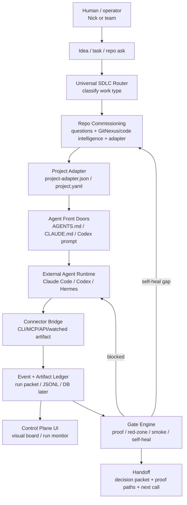
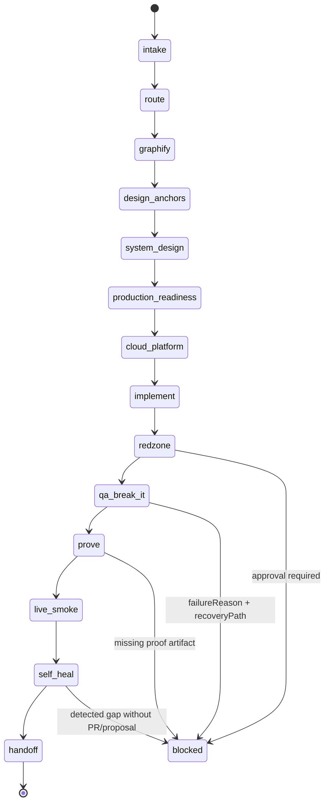
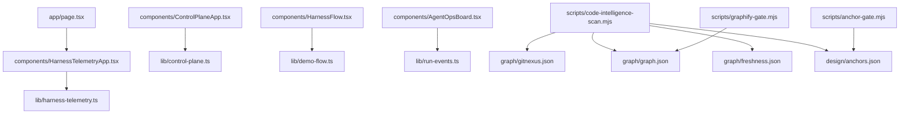
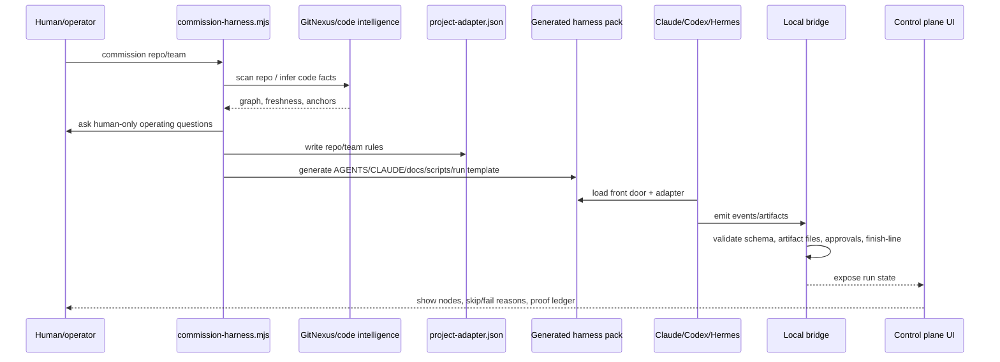
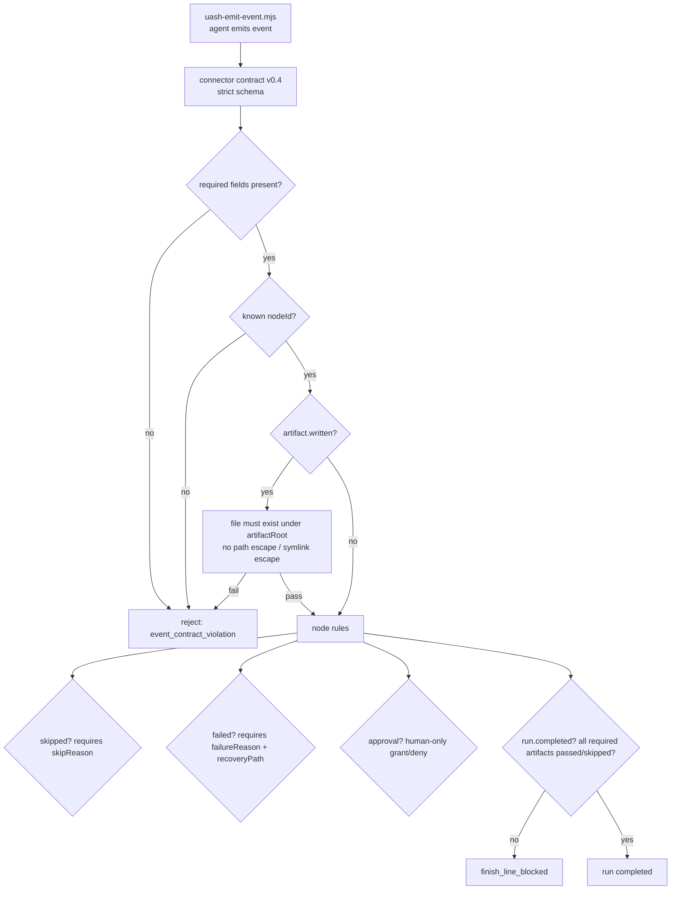
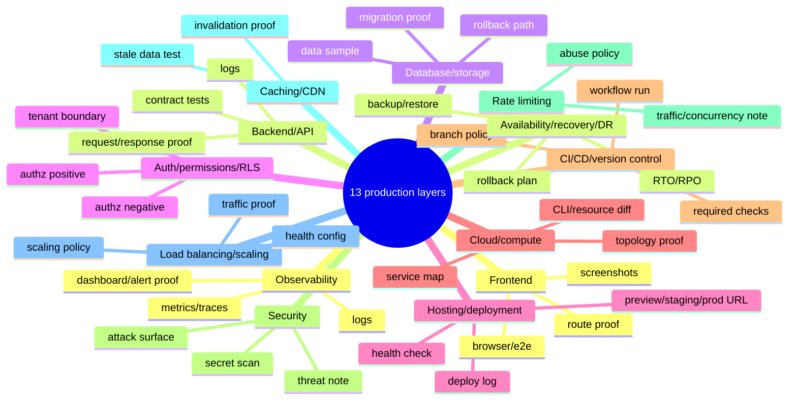

# Valdris SDLC Harness Repo Map — Current State

Generated as a grounded repo-readout for Nick. This file is intentionally blunt: it separates **built**, **policy/docs**, **verified gates**, and **missing enterprise proof-bank work**.

## Verification snapshot

Commands run against `/root/valdris-sdlc-harness`:

```bash
npm run code-intelligence:scan && npm run graphify:gate
npm run verify:harness
```

Current verified facts:

```json
{
  "graphify": {
    "ok": true,
    "nodes": 23,
    "edges": 5,
    "entrypoints": 8,
    "anchorCount": 8,
    "commit": "a0d16f76ae89d40983ae8c6d7bb0d881b8f38d6b",
    "dirty": true
  },
  "harnessVerifier": {
    "ok": true,
    "generatorVersion": "0.5.0",
    "commissioningQuestionGroups": 30,
    "commissioningQuestions": 150,
    "bridgeContractVersion": "uash.connector-events.v0.4",
    "productionLayers": 13,
    "foundationBlueprint": true,
    "codeQualityGuardrails": true,
    "enterpriseProofBank": true,
    "operatingIntelligence": true,
    "graphifyFlowNode": true,
    "graphifyGeneratedScripts": true,
    "graphifyGateSmoke": true,
    "artifactFileVerification": true,
    "symlinkEscapeBlocked": true,
    "redZoneCompletionBlocked": true,
    "agentApprovalGrantBlocked": true,
    "selfHealCompletionBlocked": true,
    "earlyCompletionBlocked": true
  }
}
```

Note: `graph/` and `design/` are generated code-intelligence artifacts and are currently untracked by git. `graph/gitnexus.json` proves the GitNexus index ran when available; fallback runs must disclose local-static graph use.

---

## 1. Universal product architecture



**Meaning:** the repo is not an IDE. It is a control plane + commissioning layer + proof gate system around existing agent runtimes.

---

## 2. Current core SDLC run flow



### Required artifact per node

```mermaid
flowchart LR
  intake["intake<br/>run/intake.json"] --> route["route<br/>run/route.json"]
  route --> graphify["graphify<br/>graph/graph.json"]
  graphify --> anchors["design-anchors<br/>design/anchors.json"]
  anchors --> design["system-design<br/>design/system_design.md"]
  design --> prod["production-readiness<br/>production/layer-assessment.json"]
  prod --> cloud["cloud-platform<br/>cloud/service-map.json or skip"]
  cloud --> impl["implement<br/>session/events.jsonl"]
  impl --> rz["redzone<br/>approvals/redzone.json"]
  rz --> qa["qa-break-it<br/>qa/break-it-results.md"]
  qa --> proof["prove<br/>proof/proof.json"]
  proof --> smoke["live-smoke<br/>smoke/smoke_proof.json or skip"]
  smoke --> heal["self-heal<br/>self_heal/self_heal_report.md"]
  heal --> handoff["handoff<br/>handoff/final.md"]
```



---

## 3. Repo file map / ICM-style tree

```text
valdris-sdlc-harness/
├── AGENTS.md                         # Codex/general agent front door for this repo
├── CLAUDE.md                         # Claude Code front door for this repo
├── README.md                         # product thesis + scripts + MVP loop
├── app/
│   ├── page.tsx                      # root route -> HarnessTelemetryApp
│   ├── layout.tsx                    # Next app layout
│   ├── globals.css                   # visual system
│   ├── docs/page.tsx                 # docs route
│   └── api/runs/demo/events/route.ts # demo/on-prem JSONL event endpoint
├── components/
│   ├── HarnessTelemetryApp.tsx       # main run-monitor UI
│   ├── ControlPlaneApp.tsx           # control-plane UI shell/run controls
│   ├── HarnessFlow.tsx               # visual flow component
│   ├── AgentOpsBoard.tsx             # agent ops board
│   └── ConnectorCards.tsx            # connector cards
├── lib/
│   ├── run-events.ts                 # workflow nodes/events/reducer for telemetry UI
│   ├── control-plane.ts              # app run model/artifacts/demo control-plane data
│   ├── harness-telemetry.ts          # telemetry scenarios and monitor data
│   └── demo-flow.ts                  # demo flow data
├── scripts/
│   ├── commission-harness.mjs        # generates project-specific harness packs
│   ├── claude-code-bridge.mjs        # strict local bridge / event contract / finish-line
│   ├── uash-emit-event.mjs           # CLI event emitter for agents
│   ├── verify-harness.mjs            # adversarial verifier suite
│   ├── code-intelligence-scan.mjs    # GitNexus-backed scan wrapper / evidence writer
│   ├── graphify-scan.mjs             # local Graphify-compatible fallback graph writer
│   ├── graphify-gate.mjs             # graph schema/freshness gate
│   ├── anchor-gate.mjs               # validates design anchors cite real files
│   └── simulate-agent-run.mjs        # local demo event simulation
├── docs/
│   ├── ARCHITECTURE.md
│   ├── UNIVERSAL_COMMISSIONING_FLOW.md
│   ├── CONNECTOR_EVENT_CONTRACT.md
│   ├── GRAPHIFY_CODE_GRAPH.md
│   ├── PRODUCTION_READINESS_LAYER_PACK.md
│   ├── CLOUD_PLATFORM_ENGINEERING.md
│   ├── QA_RELEASE_AND_SELF_HEALING.md
│   ├── SDLC_LANE_TAXONOMY.md
│   ├── MODES_BLUEPRINT_LIVE_REPLAY.md
│   ├── CLAUDE_CODE_CONNECTOR.md
│   ├── CODEX_CONNECTOR.md
│   ├── PRODUCT_DIRECTION.md
│   ├── CONNECTOR_MODEL.md
│   ├── ON_PREM_RUN_VISUALIZER.md
│   ├── VISUAL_FLOW_UI.md
│   └── HARNESS_REPO_MAP.md           # this file
├── templates/
│   ├── claude-code/commands/valdris-sdlc-harness.md
│   └── codex/valdris-sdlc-harness.md
├── research/clean-room/              # source research + clean-room product specs
├── runs/SELF-HEAL-*/                 # example real run packet with proof artifacts
├── graph/                            # generated code-intelligence artifacts, untracked
│   ├── gitnexus.json
│   ├── graph.json
│   └── freshness.json
└── design/                           # generated local anchors, untracked
    └── anchors.json
```

---

## 4. Code intelligence / GitNexus map

GitNexus index currently sees 963 nodes, 1,525 edges, 37 clusters, and 58 flows for this repo. The stable Valdris fallback graph still writes `graph/graph.json`, `graph/freshness.json`, and `design/anchors.json` for the harness gates.



Current design anchors:

```text
app/docs/page.tsx
app/page.tsx
app/layout.tsx
components/AgentOpsBoard.tsx
components/ConnectorCards.tsx
components/ControlPlaneApp.tsx
components/HarnessFlow.tsx
components/HarnessTelemetryApp.tsx
```

---

## 5. Commissioning flow



---

## 6. Connector / bridge enforcement



Verified by `npm run verify:harness`:

- strict event validation
- artifact file verification
- symlink/path escape blocked
- Red Zone completion blocked
- agent approval grant blocked
- self-heal bypass blocked
- early completion blocked

---

## 7. Production readiness layer pack



Current repo status: this layer pack is documented, included in commissioning, and verified as 13 layers in the generated adapter. It is **not yet a full enterprise proof-bank implementation with load/eval/observability scripts per layer**.

---

## 8. Current coverage matrix

| Capability | Current status | Evidence | Honest read |
|---|---:|---|---|
| Universal SDLC stage flow | Built | `lib/run-events.ts`, `lib/control-plane.ts`, connector contract | Real core flow exists |
| GitNexus/code-intelligence node | Built + verified | `graphify`, `design-anchors`, `npm run code-intelligence:*` | GitNexus preferred backend with disclosed local fallback |
| Project commissioning generator | Built + verified | `scripts/commission-harness.mjs`, verifier generated pack | Expanded to 30 groups / 150 questions with foundation + operating-intelligence fields |
| Good-looks-like foundation docs | Built structurally | generated `Good Looks Like Foundation`, `Code Quality Guardrails`, `Enterprise Proof Bank` docs | Teaches target foundation and anti-spaghetti rules before feature work |
| Operating-intelligence commissioning | Built structurally | adapter sections for evals, trajectory, context, skills, memory, tools, sandbox, model routing, economics, PR agents, MCP/A2A, lifecycle, team registry, human protocol | Questions/docs exist; executable gates remain next buildout |
| Generated agent front doors | Built | `AGENTS.md`, `CLAUDE.md`, generated pack checks | Real front-door pattern |
| Claude/Codex connector bridge | Built local v0 | `scripts/claude-code-bridge.mjs`, `uash-emit-event.mjs` | Local bridge works; MCP/hosted daemon later |
| Strict event contract | Built + verified | `CONNECTOR_EVENT_CONTRACT.md`, verifier | Good hardening exists |
| Artifact verification | Built + verified | `verify:harness` artifact/root/symlink tests | Strong MVP gate |
| Red Zone approvals | Built + verified | bridge blocks agent approval grants | Real safety boundary exists |
| Self-heal loop | Partial/built gate | docs + verifier blocks bypass | Needs productized PR/workflow UX |
| Visual run monitor | Built MVP | Next UI components + docs | Exists; can become deeper n8n-style monitor |
| Blueprint/Live/Replay separation | Built policy + UI data | docs + event types | Good; must keep enforced in UI |
| 13 production layers | Built as pack/policy + adapter | `PRODUCTION_READINESS_LAYER_PACK.md`, verifier says 13 | Exists structurally; proof banks need work |
| Cloud/platform lane | Built as lane/policy | docs + artifact path | Needs real provider adapters/scripts |
| QA/break-it/live smoke | Partial | docs + artifacts + gate positions | Needs serious automated smoke/e2e harness |
| Evals | Partial / commissioned | `OPERATING_INTELLIGENCE_LAYER.md`, adapter eval fields | Needs executable `eval-gate` script + UI coverage |
| Observability | Partial / policy | `ENTERPRISE_PROOF_BANK.md`, production layer pack | Needs actual observability proof gate/scripts |
| Enterprise load/concurrency proof | Partial / policy | `ENTERPRISE_PROOF_BANK.md` scale/concurrency dimensions | Needs load/k6/artillery/Locust validator |
| Game development domain pack | Partial / policy | serious game section in `ENTERPRISE_PROOF_BANK.md` | Needs dedicated game domain-pack artifact + gates |
| Website/web-app domain packs | Partial generic | enterprise web/growth sections in `ENTERPRISE_PROOF_BANK.md` | Needs domain-specific templates + proof validators |
| Understand-anything style repo explainer | Partial via GitNexus + this doc | `graph/gitnexus.json`, this file | Needs generated interactive repo-explainer view |

---

## 9. The proof-bank correction

The current harness proof standard is **not yet high enough** for Nick's target.

Nick's target proof standard:

```text
enterprise-scale by default
→ not 50 users
→ design for thousands / 10k+ concurrency where relevant
→ production-grade full stack
→ marketing/private-equity credible
→ scalable infrastructure story from the jump
```

### What "good proof" should become

```mermaid
flowchart TB
  ProofBank["Enterprise Proof Bank"]
  ProofBank --> Functional["Functional proof<br/>feature works end-to-end"]
  ProofBank --> Scale["Scale proof<br/>load/concurrency/capacity assumptions"]
  ProofBank --> Reliability["Reliability proof<br/>retries/failover/DR/rollback"]
  ProofBank --> Security["Security proof<br/>authz/secrets/threat boundary"]
  ProofBank --> Data["Data proof<br/>migration/integrity/tenant boundaries"]
  ProofBank --> Observability["Observability proof<br/>logs/metrics/traces/alerts"]
  ProofBank --> Cost["Cost proof<br/>scaling/cost risk"]
  ProofBank --> Domain["Domain proof<br/>game/web/app/API/AI-specific gates"]
  ProofBank --> Smoke["Live smoke<br/>target env behavior"]
  ProofBank --> Handoff["Operator handoff<br/>decision packet + Linear-ready summary"]
```



### Example: serious game proof bank should not be hobby proof

For a serious game/RPG like Shroudfront, proof should include layers like:

- gameplay loop correctness and progression integrity
- save/load/data versioning and migration
- server authority / anti-cheat model if multiplayer or online systems exist
- backend services for accounts, inventory, world state, matchmaking, telemetry, commerce if applicable
- load/concurrency model for sessions, lobbies, persistent services, chat, events
- client performance budgets by target platform
- crash/error reporting
- liveops/event pipeline
- patch/update strategy
- observability dashboards and alert paths
- rollback/cutover plan
- security/privacy/compliance if accounts/payments/minors/UGC exist
- marketing-scale launch readiness: waitlist, analytics, attribution, funnel, CDN, incident runbook

This is now encoded as a root proof-bank policy section. It still needs a dedicated executable game domain-pack artifact and gates.

---

## 10. What is actually missing next

Minimum remaining executable buildout to make the harness match Nick's full standard:

```text
docs/domain-packs/ENTERPRISE_PROOF_BANK.md or registry entry
  - promote the current root taxonomy into machine-readable domain packs
  - add scale tiers: prototype, production, enterprise, launch-surge
  - add mandatory evidence artifact schemas

docs/domain-packs/GAME_DEVELOPMENT_ENTERPRISE.md
  - serious game/RPG proof bank
  - multiplayer/backend/liveops/security/performance gates

docs/domain-packs/WEB_APP_ENTERPRISE.md
  - SaaS/web app proof bank
  - auth/data/billing/api/observability/load gates

docs/domain-packs/WEBSITE_GROWTH_ENTERPRISE.md
  - marketing site proof bank
  - SEO/perf/forms/analytics/traffic/CDN proof

scripts/load-gate.mjs
  - load/concurrency proof validator

scripts/eval-gate.mjs
  - eval artifact validator for AI/agent/RAG tasks

scripts/smoke-gate.mjs
  - live/preview smoke artifact validator

scripts/observability-gate.mjs
  - logs/metrics/traces/dashboard proof validator

lib/domain-packs.ts
  - software type classifier and domain pack registry

visual board update
  - display proof-bank coverage and missing enterprise evidence
```

---

## 11. Current verdict

```text
The repo has a real universal harness MVP:
- stage flow
- GitNexus/code intelligence
- commissioning generator
- local connector bridge
- strict event contract
- artifact verification
- Red Zone/self-heal hardening
- 13 production-readiness layer pack
- visual monitor shell

But it does not yet fully satisfy Nick's enterprise-scale proof-bank standard:
- load/concurrency proof is policy-only; no executable gate
- eval proof is commissioned; no executable eval validator yet
- observability proof is policy-only; no logs/metrics/traces gate implementation
- serious game/web/website domain packs exist as root policy sections, not dedicated machine-readable packs
- no full proof-bank registry/classifier yet
- no hosted/daemon-grade connector runtime yet
```

So the right next work is not another generic diagram. The next work is turning the newly commissioned **Enterprise Proof Bank + Foundation/Quality + Operating Intelligence** specs into executable gates, semantic validators, and visual-board enforcement.
