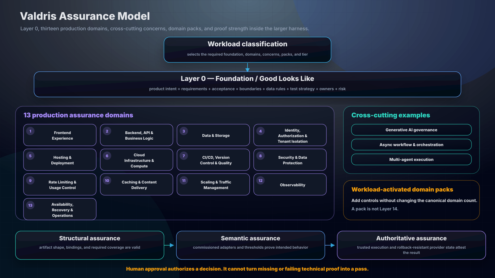

# Layer Zero and Assurance Taxonomy

## Bottom line

Valdris keeps the thirteen production-readiness layer IDs stable and adds **Layer 0: Foundation / Good Looks Like** as a prerequisite assurance overlay. Layer 0 is not a fourteenth production layer. Routing decides whether it applies, and a separate foundation assessment proves whether the commissioned baseline is fit for delivery.



The complete classification chain is:

```text
request signals
-> workload profiles and cross-cutting concerns
-> domain packs
-> foundation and production capabilities
-> controls
-> assurance tier
-> proof policy
-> typed, bound evidence
```

## Catalogs

| Catalog                              | Schema                               | Purpose                                                                                            |
| ------------------------------------ | ------------------------------------ | -------------------------------------------------------------------------------------------------- |
| `controls/foundation-layer.v1.json`  | `uash.foundation-control-catalog.v1` | Layer 0 capabilities and controls.                                                                 |
| `controls/production-layers.v2.json` | `uash.production-control-catalog.v2` | The canonical thirteen layers, capability map, 39 controls, dependencies, and proof-type policies. |
| `controls/workload-taxonomy.v1.json` | `uash.workload-taxonomy-catalog.v1`  | Assurance tiers, workload profiles, cross-cutting concerns, and the proof axis.                    |
| `controls/domain-packs/index.json`   | `uash.domain-pack-index.v1`          | Trigger-indexed executable domain catalogs.                                                        |
| `controls/domain-packs/saas.v1.json` | `uash.domain-control-catalog.v1`     | SaaS and multi-tenant controls.                                                                    |

`policies/technical-communication.v1.json` is a technical-communication reference. It is not an assurance catalog or another layer. It defines the Issue 9 target authoring profile and the evidence rules for material naming decisions.

## Layer 0: Foundation / Good Looks Like

Layer 0 answers whether the system has enough shared truth and clean boundaries for delivery to proceed safely. Every non-docs route requires it. Ordinary README/copy documentation can mark it `not-applicable` with a reason; controlled security, privacy, compliance, release, incident, AI-safety, or financial documents require the lightweight product/requirements/ownership-risk review path. When required, `foundation/assessment.json` uses `uash.foundation-assessment.v1`, binds the commissioned catalog through `catalogSha256`, binds the exact classification through `workloadClassificationSha256`, projects its `effectiveTier`, and proves every applicable foundation control.

The catalog contains seven capabilities and fourteen controls:

| Capability                  | Controls                              | Outcome                                                                                                  |
| --------------------------- | ------------------------------------- | -------------------------------------------------------------------------------------------------------- |
| Product & Domain            | `FND-PRODUCT-001`, `FND-DOMAIN-001`   | Users, outcomes, scope, terminology, ownership, and invariants are explicit.                             |
| Requirements & Acceptance   | `FND-REQ-001`, `FND-ACCEPTANCE-001`   | Requirements, constraints, negative paths, and acceptance conditions are testable.                       |
| Quality Attributes          | `FND-QUALITY-001`, `FND-FAILURE-001`  | Non-functional targets, failure modes, degradation, and recovery expectations are commissioned.          |
| Architecture & Boundaries   | `FND-ARCH-001`, `FND-BOUNDARY-001`    | Reference architecture, dependency direction, asynchronous seams, and trust boundaries are clear.        |
| Data & Transactions         | `FND-DATA-001`, `FND-TRANSACTION-001` | Data ownership, lifecycle, consistency, idempotency, ordering, reconciliation, and rollback are defined. |
| Engineering & Test Strategy | `FND-ENGINEERING-001`, `FND-TEST-001` | Delivery standards and proof strategy match the architecture and risk.                                   |
| Decisions, Ownership & Risk | `FND-DECISION-001`, `FND-RISK-001`    | Decisions, owners, Red Zone authority, escalation, runbooks, and residual risk are reviewable.           |

Layer 0 must remain separate from the production layer array so existing adapters, run packets, bridge policies, diagrams, and validators retain the canonical thirteen IDs. Foundation enforcement is additive: legacy adapters may treat the blueprint as policy, while commissioned adapters can require the separate gate.

### Two different classification jobs

Workload classification assigns a request to assurance profiles, concerns, domain packs, controls, and proof strength. Ontology-grounded classification assigns a system, architecture, concept, or term to the smallest category supported by its defining properties. These are separate procedures.

Ontology-grounded terminology and controlled technical English govern agent speech and writing. They are not Layer 0 controls and do not create another production domain. The canonical method is `docs/ONTOLOGY_AND_TECHNICAL_ENGLISH.md`; its machine-readable policy is `policies/technical-communication.v1.json`.

## Production capability map

Every production assurance domain now has:

- a stable machine ID;
- a human title;
- capability objects with stable IDs, titles, and descriptions;
- controls that reference one capability;
- catalog-declared `proofPolicy.types`.
- enforced hard `dependencies` plus non-enforcing `conditionalDependencies` that classification or human review must resolve.

The machine IDs and all 39 existing control IDs are unchanged. Human titles for the four previously overloaded layers are:

| Layer                               | Human title                         |
| ----------------------------------- | ----------------------------------- |
| `cicd-version-control`              | CI/CD, Version Control & Quality    |
| `security`                          | Security & Data Protection          |
| `error-tracking-logs-observability` | Observability                       |
| `availability-recovery-dr`          | Availability, Recovery & Operations |

The proof policies reproduce current production-gate behavior:

- seven metric controls require `metric` evidence;
- twenty-two executable controls require `command` evidence;
- ten review/provider controls require `artifact` or `provider-report` evidence.

`proofPolicy.types` identifies the qualifying evidence shapes for a passing control. Typed-evidence constraints still apply: subject, run, commit, environment, producer, trust, time, path safety, hashes, metric comparison, and human-only approvals where authority is required. Shape validation alone is not semantic proof: commissioned control adapters and acceptance-threshold policy are still required to prove that a command, artifact, metric, or provider report actually establishes the named control.

## Assurance tiers

Assurance tiers describe the minimum provenance strength expected for a workload. They do not make human approval a substitute for technical correctness.

| Tier | Label               | Intended use                                                                                       |
| ---- | ------------------- | -------------------------------------------------------------------------------------------------- |
| `T0` | Declared            | Scope and expectations are recorded, but behavior is not yet verified.                             |
| `T1` | Locally Verified    | Repeatable local automation proves the bounded behavior.                                           |
| `T2` | CI-Attested         | Proof is produced by a governed CI path and bound to source and environment.                       |
| `T3` | Externally Attested | Provider or independently governed evidence closes production, regulated, or financial boundaries. |

Approval remains an orthogonal authority proof. A human can authorize a release or risk decision, but cannot turn a failing command, metric, or missing artifact into a pass.

## Workload profiles

The taxonomy defines six composable profiles:

| Profile      | Minimum tier | Default domain overlay | AI required |
| ------------ | -----------: | ---------------------- | ----------- |
| `saas`       |         `T2` | `saas`                 | No          |
| `ai-agentic` |         `T2` | AI assurance catalog   | Yes         |
| `mobile`     |         `T2` | `mobile-ios`           | No          |
| `regulated`  |         `T3` | Workload-specific      | No          |
| `payments`   |         `T3` | `digital-commerce`     | No          |
| `realtime`   |         `T2` | `multiplayer-realtime` | No          |

Profiles are composable. A mobile SaaS product with AI and payments should activate `mobile`, `saas`, `ai-agentic`, and `payments`, then resolve the maximum minimum tier and the union of required domain packs and cross-cutting controls. A profile never removes an intake-selected control or lowers an assurance tier.

## Cross-cutting concerns

Cross-cutting concerns prevent important architecture from disappearing between a domain label and the thirteen-layer map. Each concern declares triggers plus existing production-layer, production-control, and AI-control IDs.

`async-workflow-orchestration` is the canonical pattern for queues, workers, jobs, event-driven flows, webhooks, sagas, and retries. It maps to backend contracts and failure handling, data integrity, overload behavior, telemetry, and incident operations rather than inventing a fourteenth infrastructure layer.

The catalog also covers multi-tenant isolation, identity and access governance, financial transaction integrity, privacy and data governance, regulated/high-impact decision governance, generative AI governance, realtime state coordination, and production release governance.

## SaaS domain pack

The `saas` pack adds six executable domain controls:

| Control                 | Scope                                                                                                  |
| ----------------------- | ------------------------------------------------------------------------------------------------------ |
| `SAAS-TENANT-001`       | Tenant isolation across application, data, cache, search, jobs, files, analytics, and support.         |
| `SAAS-ROLES-001`        | Organization membership, roles, invitations, privileged administration, SSO, SCIM, and deprovisioning. |
| `SAAS-ENTITLEMENTS-001` | Plans, features, seats, limits, trials, upgrades, downgrades, cancellations, and grace periods.        |
| `SAAS-METERING-001`     | Idempotent, tenant-bound, reconcilable usage and billing meters.                                       |
| `SAAS-LIFECYCLE-001`    | Provisioning, migration, suspension, export, retention, deletion, restoration, and offboarding.        |
| `SAAS-AUDIT-001`        | Immutable, access-controlled, privacy-safe tenant and administrative audit records.                    |

These controls supplement rather than replace `AUTH-TENANT-001`, `DATA-INTEGRITY-001`, `CACHE-ISOLATION-001`, `RATE-METERING-001`, and related universal controls.

## Proof axis

The shared evidence vocabulary remains:

```text
artifact | command | metric | approval | provider-report
```

Evidence is resolved against the control's proof policy and bound across subject, run ID, workload profile, commit, environment, producer, trust tier, and timestamp. The strongest active workload profile establishes the minimum tier; control-specific and provider-specific contracts may demand stronger evidence.

## Compatibility rules

1. The production catalog remains `uash.production-control-catalog.v2`.
2. All thirteen production layer IDs and all 39 production control IDs remain unchanged.
3. Capability and proof-policy metadata is additive; older validators can continue using their existing ID and evidence-type tables.
4. Foundation is a separate assessment and gate, not an array entry in production readiness.
5. Workload profiles and concerns may add controls or raise proof strength; they may not silently remove controls selected by intake or domain triggers.
6. Existing domain packs retain `uash.domain-control-catalog.v1`; SaaS joins that executable pack family.
7. Catalog digests must be refreshed for new routes after any catalog change. Existing immutable run packets remain bound to the catalogs they approved, but replay also requires preserving or resolving the corresponding catalog/harness snapshot; a digest alone is not a version resolver.
