# Valdris SDLC Harness — Mermaid Maps

These diagrams are the **repo operating map**, not a raw import graph.

A raw diagram with every file would turn into spaghetti. These maps keep the repo readable by grouping files by responsibility, lane, gate, artifact, and runtime boundary.

## How to read the maps

| Term | Meaning |
|---|---|
| **Lane** | Type of work routed through the harness: bug, feature, cloud, security, incident, QA, etc. |
| **Stage** | Step inside the work: intake, route, design, implement, prove, handoff. |
| **Gate** | Blocking verification check: proof, Red Zone, smoke, finish-line, self-heal. |
| **Layer** | Production-readiness dimension: frontend, backend, DB, auth, cloud, observability, recovery, etc. |
| **Artifact** | Evidence file proving the stage/gate happened. |

> Mode note: these are **Blueprint** diagrams. A real **Live Run** requires connector events from Claude Code, Codex, Hermes, MCP/API/CLI emitters, or watched artifacts.

---

## 1. Whole repo operating map


<details>
<summary>Mermaid source</summary>

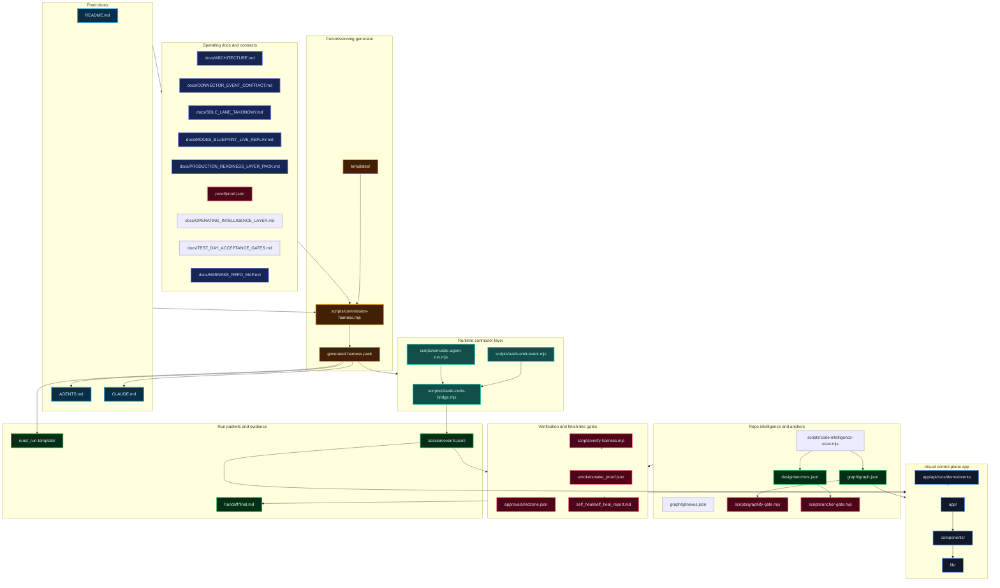

</details>

---

## 2. Universal core vs project adapter

This is the public product shape: universal harness logic stays reusable, while each repo gets a generated adapter.


<details>
<summary>Mermaid source</summary>

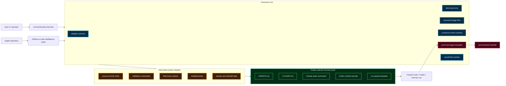

</details>

---

## 3. Work lanes map

These are the lanes people should see first when asking, “where does my work go?”


<details>
<summary>Mermaid source</summary>

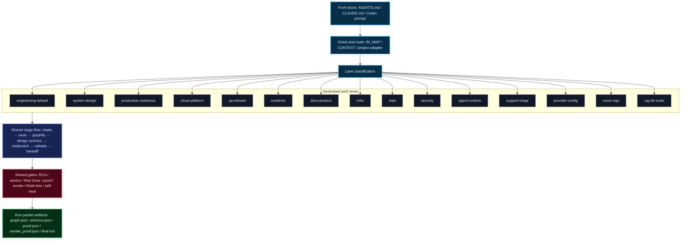

</details>

---

## 4. Connector event flow

The connector is what turns external agent work into harness-observable events.


<details>
<summary>Mermaid source</summary>

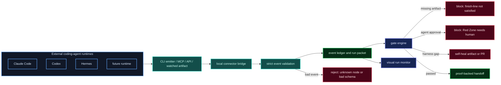

</details>

---

## 5. 13-layer production readiness pack

The 13 layers are not the whole harness. They are a production-readiness pack that activates when a task touches real product, infra, deploy, users, data, security, or reliability.


<details>
<summary>Mermaid source</summary>

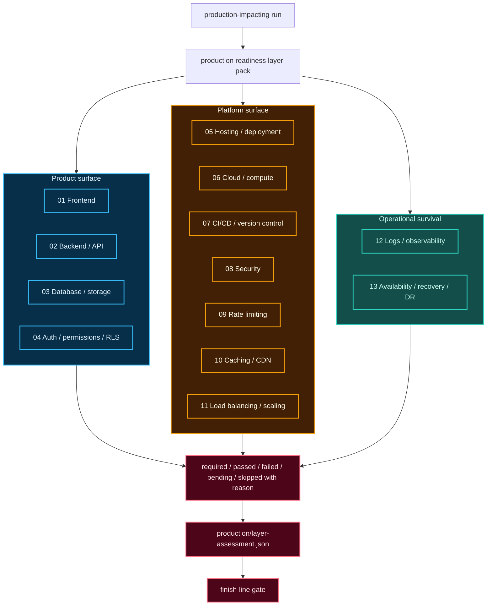

</details>

---

## 6. Generated harness pack

This is what `npm run commission` creates for a target repo.


<details>
<summary>Mermaid source</summary>

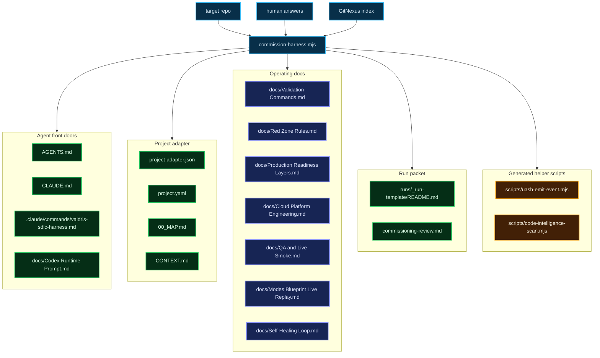

</details>

---

## 7. README rule of thumb

For the README, keep only one simple overview image/diagram and link here for the deeper maps.

Recommended README line:

```md
For lane-by-lane and repo-level Mermaid diagrams, see [Repo Mermaid Maps](docs/REPO_MERMAID_MAPS.md).
```

That keeps the README readable while still giving technical users a full visual map.
