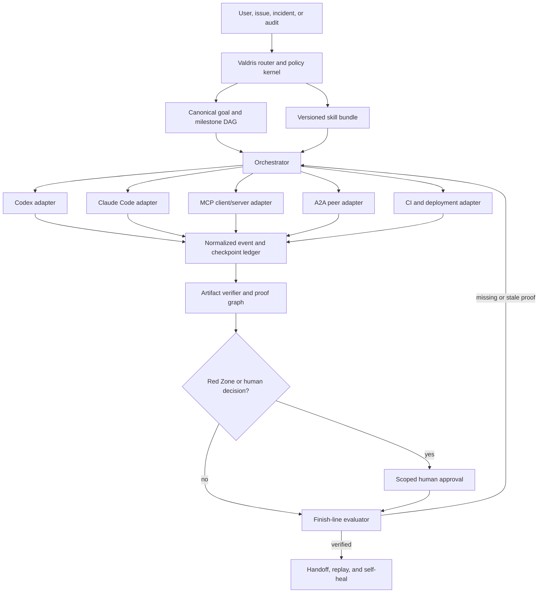

# Valdris Agent Workflows and Interoperability Architecture

**Research date:** 2026-07-12

**Scope:** portable skills, hooks, durable goals, orchestration, proof handoffs, MCP, A2A, Codex, Claude Code, and CI

**Evidence policy:** primary specifications, official product documentation, upstream source, and the current Valdris checkout

## Executive conclusion

Valdris can become the goal-and-loop control plane described in the commissioning papers, but it should not try to replace Codex, Claude Code, MCP, A2A, or GitHub Actions. It should own the parts those runtimes do not share:

- canonical intake and risk classification;
- a portable skill registry and deterministic composition policy;
- durable goal, milestone, checkpoint, approval, and proof state;
- runtime-neutral event normalization;
- verification of artifacts against the exact repository state;
- Red Zone enforcement and human approval boundaries;
- replay, audit, and final handoff.

The coding runtime should remain replaceable. Codex and Claude Code now both have native `/goal` loops, reusable skills, lifecycle hooks, resumable sessions, and programmatic interfaces. Those native facilities should accelerate a run, but they must not be the system of record or the authority that declares a Valdris run complete. Codex explicitly supports durable goals with checkpoints and verifiable stopping conditions, while its App Server exposes persisted goal state and resumable thread APIs ([Codex goals](https://learn.chatgpt.com/use-cases/follow-goals), [Codex App Server](https://learn.chatgpt.com/docs/app-server)). Claude Code also has `/goal`, but its completion evaluator judges only what has been surfaced in the transcript and does not independently run commands or inspect files ([Claude Code goals](https://code.claude.com/docs/en/goal)). Valdris therefore must mechanically re-check the claimed proof.

The target is an eight-skill public interface, backed by a non-model control kernel:

1. `valdris-route`
2. `valdris-discover`
3. `valdris-diagnose`
4. `valdris-deliver`
5. `valdris-architect`
6. `valdris-assure`
7. `valdris-release`
8. `valdris-handoff`

The router chooses the smallest bundle, adds mandatory assurance and handoff overlays based on risk, and records the exact skill versions and reasons in `run/route.json`. The model may propose a route. Only the router validates and activates it.

## Research method and source posture

This research used:

- current official OpenAI Codex documentation for `AGENTS.md`, skills, hooks, App Server, SDK, non-interactive mode, and goals;
- current official Anthropic Claude Code documentation for `CLAUDE.md`, skills, hooks, programmatic execution, and goals;
- the [Agent Skills specification](https://agentskills.io/specification);
- the latest released [MCP specification](https://modelcontextprotocol.io/specification/latest), which resolves to protocol revision `2025-11-25` as of the research date;
- the latest released [A2A 1.0 specification](https://a2a-protocol.org/latest/specification/);
- official GitHub Actions documentation for protected environments, concurrency, artifacts, and attestations;
- the installed and upstream [mattpocock/skills](https://github.com/mattpocock/skills) source;
- the current dirty Valdris branch, including its commissioned adapter fields, bridge, proof schema, event contract, templates, and knowledge vault.

Claims from product documentation are treated as runtime capabilities, not as evidence that the current Valdris code already integrates them.

## Standards findings

### 1. Portable skills are real, but only at the base format

The Agent Skills standard defines a directory containing `SKILL.md`, required `name` and `description` metadata, and optional scripts, references, and assets. It recommends progressive disclosure: metadata at discovery, instructions on activation, resources only when needed ([Agent Skills specification](https://agentskills.io/specification)). OpenAI documents the same loading pattern and supports repo skills in `.agents/skills`; skills may be explicitly invoked or implicitly selected from their descriptions ([Codex customization](https://learn.chatgpt.com/docs/customization/overview)). Claude Code follows the standard but uses `.claude/skills` natively and adds runtime-specific frontmatter such as `disable-model-invocation`, `user-invocable`, `context: fork`, scoped hooks, and subagent selection ([Claude Code skills](https://code.claude.com/docs/en/slash-commands)).

Consequences for Valdris:

- The canonical source must use only the portable Agent Skills subset.
- Invocation control, runtime placement, subagent selection, hooks, permissions, and model/effort settings belong in a Valdris registry and generated runtime overlays.
- A Claude-only frontmatter flag must never be the sole Red Zone control.
- `.agents/skills` should be canonical. The commissioner should generate copies into `.claude/skills` for Claude Code. Copies need source digests and a drift gate; symlinks are not a reliable Windows distribution strategy.
- Skills need independent activation evals and outcome evals. The official Agent Skills guidance distinguishes whether a skill triggered from whether it produced the expected result ([skill evaluation](https://agentskills.io/skill-creation/evaluating-skills)).

The standard does not define composition, dependencies, version locking, invocation authorization, or proof contracts. Those are Valdris extensions, not portable Agent Skills features.

### 2. Persistent instructions are context, not enforcement

OpenAI positions `AGENTS.md` as small, durable repository guidance and skills as reusable procedures loaded only when relevant ([Codex customization](https://learn.chatgpt.com/docs/customization/overview)). Anthropic explicitly states that `CLAUDE.md` and auto memory are context rather than enforced configuration, recommending hooks or settings to block actions regardless of model choice ([Claude Code memory](https://code.claude.com/docs/en/memory)).

Therefore:

- `AGENTS.md` and `CLAUDE.md` should explain how to enter Valdris, not contain the whole workflow.
- Mechanical invariants belong in the bridge, gate scripts, hooks, CI, or protected deployment environments.
- Generated `CLAUDE.md` should import `AGENTS.md` and add only Claude-specific notes. Anthropic recommends this exact pattern for cross-agent repositories and specifically recommends imports rather than symlinks on Windows ([Claude Code memory](https://code.claude.com/docs/en/memory)).

### 3. Hooks are runtime sensors and local guardrails, not the canonical ledger

Codex supports trusted project hooks in `.codex/hooks.json` or `.codex/config.toml`, including pre-tool, post-tool, compaction, subagent, and stop events ([Codex hooks](https://learn.chatgpt.com/docs/hooks)). Claude Code supports command, HTTP, MCP-tool, prompt, and agent hooks at lifecycle events and merges all matching hook results ([Claude Code hooks](https://code.claude.com/docs/en/hooks-guide)). Both runtimes may run multiple matching hooks, so one hook cannot be assumed to suppress every sibling side effect.

Valdris should use hooks to:

- append normalized runtime events;
- enforce pre-tool Red Zone policy;
- capture post-tool command and artifact metadata;
- emit checkpoint candidates after compaction and stop;
- block a runtime-level stop when required local proof is absent.

Hooks must be idempotent, fast, and safe to retry. The bridge remains responsible for validating event transitions and artifacts. Hooks report; they do not self-certify.

### 4. Native goals are useful workers, not a shared durable-goal protocol

Codex goals support an objective, stopping condition, checkpoints, progress logs, pause/resume controls, and multi-hour work. The App Server exposes `thread/goal/set`, `thread/goal/get`, `thread/goal/clear`, goal status, optional token budget, token usage, and time usage ([Codex goal use case](https://learn.chatgpt.com/use-cases/follow-goals), [Codex App Server](https://learn.chatgpt.com/docs/app-server)).

Claude Code `/goal` is a session-scoped prompt-based Stop hook. A separate evaluator checks the transcript after each turn, active goals restore on session resume, and non-interactive `claude -p "/goal ..."` can run the loop to completion ([Claude Code goals](https://code.claude.com/docs/en/goal)). Its evaluator does not call tools, so the condition must be demonstrated in the transcript.

These implementations are not wire-compatible and do not share milestone, artifact, approval, or proof semantics. Valdris should:

1. create its own canonical `goalId` and milestone DAG;
2. bind that goal to zero or more runtime-native goal/session IDs;
3. let native goals continue work within a milestone;
4. import runtime status as untrusted observations;
5. independently validate milestone and finish-line conditions;
6. support runtime migration without losing the goal.

### 5. MCP and A2A solve different boundaries

MCP is a host-client-server protocol for external context and tools. The latest released specification uses JSON-RPC, capability negotiation, tools, resources, prompts, progress, cancellation, and authorization ([MCP specification](https://modelcontextprotocol.io/specification/latest), [architecture](https://modelcontextprotocol.io/docs/learn/architecture)). MCP explicitly warns that tool descriptions and annotations are untrusted unless the server is trusted, and requires user control around data and actions. Its OAuth profile requires protected-resource discovery, resource indicators, audience-bound tokens, and forbids token passthrough ([MCP authorization](https://modelcontextprotocol.io/specification/2025-11-25/basic/authorization)).

A2A is for communication between independent, potentially opaque agent systems. A2A 1.0 defines Agent Cards for discovery, messages, tasks, artifacts, version negotiation, streaming, push notifications, and states including `SUBMITTED`, `WORKING`, `INPUT_REQUIRED`, `AUTH_REQUIRED`, `COMPLETED`, `FAILED`, `CANCELED`, and `REJECTED` ([A2A specification](https://a2a-protocol.org/latest/specification/)). It can expose an authenticated extended Agent Card and supports signed Agent Cards.

Use them this way:

| Boundary                                                       | Protocol                       | Valdris use                                                                 |
| -------------------------------------------------------------- | ------------------------------ | --------------------------------------------------------------------------- |
| Runtime needs tools or context                                 | MCP                            | expose run, artifact, gate, approval-request, and finish-check capabilities |
| Valdris delegates a bounded job to an independent remote agent | A2A                            | create a child task bound to one milestone and ingest verified artifacts    |
| Local Codex/Claude process                                     | native SDK/App Server/CLI      | richest runtime events and resume semantics                                 |
| CI and deployment                                              | GitHub Actions or provider API | externally verifiable commands, environments, and release evidence          |

Do not model every local subagent as A2A. Do not expose a remote peer agent as an unrestricted MCP tool without a task, identity, authorization, and artifact boundary.

MCP `2025-11-25` includes experimental tasks, while the finalized Tasks extension redesign is not wire-compatible with that experimental surface ([MCP tasks](https://modelcontextprotocol.io/specification/2025-11-25/basic/utilities/tasks), [Tasks extension SEP](https://modelcontextprotocol.io/seps/2663-tasks-extension)). Valdris must keep its goal/checkpoint state independent and map to an MCP task shape only after explicit capability and protocol-version negotiation.

### 6. CI is a proof producer and approval boundary

GitHub Actions protected environments can require reviewers, prevent self-review, restrict deployment branches, withhold environment secrets until approval, and apply custom protection rules ([GitHub environments](https://docs.github.com/en/actions/reference/workflows-and-actions/deployments-and-environments)). Concurrency groups can prevent overlapping deployments but are independent from environment protection ([deployment controls](https://docs.github.com/en/actions/how-tos/deploy/configure-and-manage-deployments/control-deployments)).

For Valdris:

- CI should produce signed or hashed proof inputs, not merely a green badge string.
- Production deployment must target a protected environment and remain outside model-granted approval.
- Use concurrency per environment so two goal runs cannot deploy the same target simultaneously.
- Use GitHub artifact attestations for distributable binaries, packages, container images, and manifests. Attestations bind an artifact to its workflow, repository, environment, commit, and trigger, but GitHub explicitly warns that provenance is not a guarantee that software is secure ([artifact attestations](https://docs.github.com/en/actions/concepts/security/artifact-attestations)).
- Do not generate attestations for every Markdown proof file. Hash and retain run proof; attest release subjects people actually consume.

## Upstream workflow audit: mattpocock/skills

The upstream router provides an excellent human-readable engineering flow:

`grill-with-docs -> prototype/research/wayfinder -> to-spec -> to-tickets -> implement -> tdd -> code-review`

The upstream `ask-matt` skill distinguishes a single-session idea, a multi-session wayfinding effort, raw incoming issue triage, hard-bug diagnosis, and codebase-health work ([ask-matt](https://github.com/mattpocock/skills/blob/main/skills/engineering/ask-matt/SKILL.md)). `grill-with-docs` composes grilling with domain modeling and leaves ADR/glossary artifacts ([grill-with-docs](https://github.com/mattpocock/skills/blob/main/skills/engineering/grill-with-docs/SKILL.md)). `wayfinder` creates a durable investigation map with a frontier, blocking edges, one ticket per session, and explicit fog of war ([wayfinder](https://github.com/mattpocock/skills/blob/main/skills/engineering/wayfinder/SKILL.md)).

What Valdris should adopt:

- one explicit entry router;
- grilling before irreversible design;
- cited research as an input to decisions, not a substitute for decisions;
- runnable prototypes for questions prose cannot settle;
- a durable map for multi-session ambiguity;
- tracer-bullet tickets with blocking edges;
- fresh implementation contexts per ticket;
- TDD at agreed public seams;
- independent Standards and Spec review axes;
- handoff files at context boundaries.

What Valdris must add or change:

1. **Machine-readable composition.** Upstream composition is mostly prose that tells one skill to invoke another. Valdris needs a registry, dependency conditions, version digests, and runtime-specific invocation adapters.
2. **Proof contracts.** Upstream skills do not bind completion to typed, fresh, environment-specific proof artifacts.
3. **Risk-aware authorization.** Several upstream action skills use `disable-model-invocation: true`, which is useful in Claude Code but not portable enforcement. Valdris must enforce invocation policy outside skill frontmatter.
4. **Separate edit from publish.** Upstream `implement` ends by committing. Valdris must treat commit, push, PR creation, staging deploy, and production deploy as separately authorized actions.
5. **Precommissioned seams.** Upstream TDD asks the user to confirm test seams before writing tests. Valdris should commission default seams so low-risk work can proceed autonomously and escalate only when a new seam is material.
6. **Goal and checkpoint state.** Tracker tickets are useful work items, but they are not a crash-safe execution ledger.
7. **Runtime neutrality.** Slash-command chaining and Claude-only frontmatter need portable equivalents.
8. **Production and AI assurance.** The 13 layers, AI behavior evals, trajectory checks, Red Zones, cost budgets, live smoke, and rollback evidence must compose into the engineering flow.

## Current Valdris audit

### Strengths to preserve

- The bridge treats `prove` and `handoff` as finish-line invariants even when an adapter attempts to narrow required nodes (`scripts/claude-code-bridge.mjs`).
- Artifact paths are resolved under an allowed root, symlink/path escapes are rejected, and `artifactRoot` is immutable after run creation.
- Human approval events require a real pending approval, `actor: human`, and an operator-held token.
- The proof and production-readiness documents have schemas and negative verifier cases.
- All 13 production layers must be represented as passed with evidence or skipped with reasons.
- Live, replay, and blueprint modes are distinguished.
- `knowledge/index.md` provides a progressive-disclosure entry point.
- The commissioning model already asks about evals, trajectory, context, skills, memory, tools, sandboxes, model routing, economics, background agents, MCP/A2A, and production-agent lifecycle.

### Gaps that block the target architecture

| Gap                                   | Current evidence                                                                          | Required correction                                                                                         |
| ------------------------------------- | ----------------------------------------------------------------------------------------- | ----------------------------------------------------------------------------------------------------------- |
| No executable skill catalog           | `operatingIntelligence.skillRegistry.inventory` is generated from comma-separated answers | generate canonical skill directories, registry, lock/digest file, activation evals, and runtime projections |
| No composition engine                 | front doors contain one fixed 14-node sequence                                            | compile a task-specific milestone DAG from the selected skill bundle                                        |
| Node vocabulary is closed             | bridge rejects node IDs outside its fixed set                                             | distinguish stable phase IDs from adapter-defined milestone IDs; validate both schemas                      |
| Native goals are not bound            | no Codex thread goal, Claude session goal, or runtime binding artifact                    | add canonical goal schema and runtime binding records                                                       |
| Checkpoints are not durable           | event JSONL records node events but not resumable milestone snapshots                     | add append-only checkpoint transitions with repository and proof digests                                    |
| Operating intelligence is policy-only | `docs/OPERATING_INTELLIGENCE_LAYER.md` marks eval/trajectory/economics gates partial      | implement typed gates and make them route-conditionally required                                            |
| Proof is too weakly bound             | command output and exit code are checked, but proof is not a full subject manifest        | bind every proof to run, goal, milestone, repo, commit/tree, environment, command, time, and content digest |
| Run start requires supplied IDs       | generated prompts ask for `RUN_ID` before work                                            | allow the router/bridge to create a run safely; never make users invent IDs                                 |
| Runtime connector is Claude-named     | bridge file and service names are Claude-centric although actors include Codex/Hermes     | split core run service from runtime adapters                                                                |
| No MCP/A2A runtime                    | commissioning fields and docs exist, but hosted daemon/peer interface is future           | build MCP first; add A2A only for real peer delegation                                                      |
| No skill drift enforcement            | the knowledge vault has a validator, skills do not                                        | validate frontmatter, links, referenced scripts, hashes, ownership, eval cases, and generated-copy parity   |

## Target architecture



### Ownership rule

| Concern                                                    | Owner                                             |
| ---------------------------------------------------------- | ------------------------------------------------- |
| Natural-language reasoning, edits, local command proposals | runtime agent                                     |
| Work classification and skill-bundle validity              | Valdris router                                    |
| Goal, milestone, checkpoint, and approval state            | Valdris ledger                                    |
| Tool permission and Red Zone enforcement                   | Valdris policy kernel plus runtime hooks/settings |
| Test/eval execution                                        | runtime or CI                                     |
| Proof validity and freshness                               | Valdris gate                                      |
| Production credentials and approval                        | human/protected environment                       |
| Runtime session storage                                    | runtime adapter                                   |
| Cross-runtime replay and audit                             | Valdris                                           |

## The eight composable skills

These are the user-facing choices. A user may name one explicitly; otherwise `valdris-route` selects the bundle. Every nontrivial mutating bundle ends in `valdris-handoff`.

| Skill               | Use when                                                                              | Typical upstream techniques                                                           | Required outputs                                                                   | Default invocation                                                     |
| ------------------- | ------------------------------------------------------------------------------------- | ------------------------------------------------------------------------------------- | ---------------------------------------------------------------------------------- | ---------------------------------------------------------------------- |
| `valdris-route`     | any new request, issue, audit, bug, feature, incident, or goal                        | ask-matt-style routing, risk and maturity classification                              | `run/intake.json`, `run/route.json`, goal decision, skill bundle                   | user or model; always first logically                                  |
| `valdris-discover`  | ambiguity, product/design questions, research, specifications, huge foggy work        | grill-with-docs, domain modeling, research, prototype, wayfinder, to-spec, to-tickets | glossary/ADR updates, research, decision map, spec, ticket DAG                     | user or model; writes docs/tracker only within scope                   |
| `valdris-diagnose`  | bug, failure, flake, regression, performance issue, incident symptom                  | tight failing loop, bisection, RCA, evidence timeline                                 | reproducer, hypotheses ledger, root cause, recovery path, regression-test proposal | user or model; no fix unless task authorizes change                    |
| `valdris-deliver`   | accepted issue/spec needs implementation                                              | implement, TDD, vertical slices                                                       | code, tests, local validation, implementation events                               | user or model when task clearly authorizes changes                     |
| `valdris-architect` | architecture, refactor, migration, new module boundary, hard-to-reverse decision      | code intelligence, deep modules, prototypes, ADRs, expand-contract                    | graph/anchors, design, ADR, migration/rollback plan                                | user or model; approval before hard-to-reverse external change         |
| `valdris-assure`    | security/privacy, AI/RAG/agent behavior, data integrity, production readiness, review | threat modeling, 13 layers, evals, trajectory review, two-axis code review            | profile-specific assessments, tests/evals, layer assessment, findings              | user or model; read/verify by default; remediation needs authorization |
| `valdris-release`   | CI/CD, staging, production, cloud mutation, rollout, rollback, live smoke             | release checklist, protected environments, canary, smoke, observability               | release plan, approvals, deployment and rollback proof, live smoke                 | user-only for external mutation; model may plan/dry-run                |
| `valdris-handoff`   | checkpoint, context boundary, PR/review, or run completion                            | proof packet, code review, handoff, memory proposal, self-heal                        | proof manifest, review, final handoff, next action, self-heal result               | user or model; mandatory after mutation and before done                |

### Assurance profiles

`valdris-assure` is one workflow interface with composable profiles, not one giant prompt:

- `security`: threat, authn/authz, secrets, dependency, injection, abuse;
- `privacy`: data classification, retention, deletion, consent, audit conflict;
- `production`: all 13 layers, with explicit pass or skip evidence;
- `ai-behavior`: prompt/model/tool/RAG evals, safety, cost, latency, drift;
- `trajectory`: context loads, tool order, retries, approvals, skipped gates;
- `data`: schema, migrations, integrity, provenance, backup/restore;
- `spec-review`: requirements coverage and scope creep;
- `standards-review`: repository standards and maintainability.

The router activates only relevant profiles. Every run still classifies all 13 production layers and records why each profile or layer is skipped.

## Invocation and composition rules

### Portable registry

The Agent Skills file remains portable. Valdris policy is stored separately:

```yaml
schema: valdris.skills.v1
skills:
  - id: valdris-release
    version: 1.0.0
    source: .agents/skills/valdris-release/SKILL.md
    sourceDigest: sha256:...
    invocation:
      user: true
      model: plan-only
    sideEffects: external
    redZone: always-for-execution
    requires: [valdris-route]
    requiresAfter: [valdris-handoff]
    proofProfiles: [release, production, live-smoke]
```

Proposed layout:

```text
.agents/skills/                         # canonical portable Agent Skills
  valdris-route/SKILL.md
  ...
.valdris/skills/registry.yaml          # composition and authorization
.valdris/skills/lock.json              # version + content digests
.valdris/adapters/codex/               # Codex hook/config projection
.valdris/adapters/claude/              # Claude frontmatter/config projection
.claude/skills/                        # generated copies for Claude Code
skills/evals/                           # activation and outcome cases
```

### Router algorithm

The route is deterministic around model judgment:

1. Normalize task, repository, environment, requested outcome, explicit skill names, and authorization verbs.
2. Classify work type, mutation scope, affected users/data, reversibility, runtime, time horizon, and ambiguity.
3. Classify all 13 production layers plus AI/data assurance profiles.
4. Honor an explicit user-selected skill unless it conflicts with policy; add mandatory overlays rather than silently replacing it.
5. Ask a model for a ranked bundle only where semantic classification is needed.
6. Validate that bundle against registry constraints, allowed invocation, dependencies, side effects, runtime capabilities, and Red Zones.
7. Add `valdris-assure` for sensitive, AI-behavior, cross-layer, or production-impacting work.
8. Add `valdris-handoff` for every mutating run and every goal checkpoint.
9. Add `valdris-release` only when deployed/provider/cloud state may change.
10. Create a durable goal when work has multiple milestones, requires retries/experiments, may cross sessions, or has a long-running external wait.
11. Persist reasons, rejected alternatives, skill versions/digests, layer/profile classification, skip reasons, and approval requirements.

### User versus model invocation

| Action                                                                                       |               Model may select? | Human confirmation                                 |
| -------------------------------------------------------------------------------------------- | ------------------------------: | -------------------------------------------------- |
| Route, read, research, classify, plan, audit                                                 |                             yes | only for material ambiguity or private-data access |
| Edit files in authorized workspace                                                           | yes when task authorizes change | no additional confirmation for low-risk local work |
| Run tests/evals/scans                                                                        |                             yes | no, unless cost/data/tool policy requires it       |
| Commit                                                                                       |   only if commissioning permits | task or standing repo authorization                |
| Push/open PR/update issue                                                                    |   only if commissioning permits | task or standing integration authorization         |
| Stage deploy                                                                                 |      only through release skill | commissioning policy or scoped approval            |
| Production deploy, secret/config mutation, billing/auth/customer data, destructive operation |             no autonomous grant | explicit scoped Red Zone approval                  |

Runtime-specific `disable-model-invocation` or equivalent fields are defense in depth. The registry and bridge decide whether an invocation is valid.

## Durable goal and checkpoint model

### Canonical artifacts

```text
goal/goal.json                 # objective, stop condition, constraints, status, budgets
goal/milestones.json           # dependency DAG and proof requirements
goal/checkpoints.jsonl         # append-only transitions
goal/runtime-bindings.json     # Codex, Claude, MCP, A2A, CI identifiers
run/route.json                 # resolved skill bundle and assurance classification
proof/artifact-manifest.json   # content-addressed proof graph
handoff/final.md               # human-readable outcome
```

### Goal state

`goal/goal.json` should contain:

- `schema`, `goalId`, `runId`, `version`;
- one objective and one mechanical stop condition;
- acceptance criteria and non-goals;
- risk class and Red Zone policy;
- token, time, retry, spend, and external-action budgets;
- repository identity, allowed roots, base commit, branch/worktree;
- current status: `draft`, `active`, `waiting_for_input`, `waiting_for_approval`, `blocked`, `achieved`, `failed`, or `cancelled`;
- owner, reviewers, created/updated timestamps;
- a monotonic revision for compare-and-swap updates.

Only the finish-line gate may set `achieved`. A runtime may report `completed`; the adapter records that observation and requests evaluation.

### Milestone state

Each milestone declares:

- `milestoneId`, title, dependencies, and selected skill/version;
- preconditions and expected repository/environment state;
- required artifacts and proof schemas;
- validation commands/evals and freshness constraints;
- allowed tools, side-effect class, approval requirement;
- retry policy and recovery path;
- status and terminal reason.

The orchestrator schedules only milestones whose dependencies are verified. Parallel milestones use isolated worktrees or read-only contexts and must declare their merge/fan-in milestone.

### Checkpoint event

Every checkpoint is append-only and idempotent:

```json
{
  "schema": "valdris.checkpoint.v1",
  "eventId": "uuid",
  "goalId": "GOAL-...",
  "runId": "RUN-...",
  "milestoneId": "M3",
  "attempt": 2,
  "transition": "validation_passed",
  "actor": "codex",
  "runtimeSessionId": "thr_...",
  "repository": {
    "headSha": "...",
    "treeDigest": "sha256:...",
    "dirtyDigest": "sha256:..."
  },
  "skillDigests": ["sha256:..."],
  "proofRefs": ["proof://..."],
  "timestamp": "RFC3339",
  "nextEligible": ["M4"]
}
```

Required properties:

- unique `eventId` and monotonic per-milestone sequence;
- compare-and-swap revision to prevent two agents advancing the same milestone;
- exact repository/worktree fingerprint;
- content digests rather than existence-only proof;
- explicit `waiting_for_input`, `waiting_for_approval`, skip, failure, and recovery transitions;
- replay that reconstructs current state without trusting a mutable summary.

## Proof handoff contract

An artifact is not proof merely because a runtime says it wrote a file. `proof/artifact-manifest.json` should be a graph of subjects, producers, validations, and approvals.

Each evidence record needs:

- artifact ID, schema, media type, path/URI, SHA-256 digest, and size;
- producer runtime, session, skill ID/version/digest, and actor;
- source run, goal, milestone, repository, commit/tree/dirty digest;
- environment identity and toolchain versions;
- command/eval name, normalized arguments, start/end times, exit status;
- bounded stdout/stderr or log digest plus immutable log reference;
- prerequisites and upstream evidence digests;
- freshness rule and expiry if evidence can become stale;
- verifier identity/version and verification result;
- associated approval ID/scope where needed;
- CI run/job/attempt URL and release attestation subject where applicable.

### Proof acceptance rules

1. Evidence must match the active run, goal, milestone, repository, and environment.
2. Code proof must match the current source subject. Dirty worktrees need a deterministic dirty-tree digest.
3. A later relevant edit invalidates earlier affected proof.
4. A command exit code alone is insufficient when the command did not execute the intended tests/evals.
5. Runtime-produced summaries are claims until the verifier reads the source artifact or CI API result.
6. Remote-agent artifacts are quarantined until schema, digest, authorization, and content policy checks pass.
7. Skip evidence has the same ownership and freshness requirements as pass evidence.
8. Approval is scoped to an action, subject, environment, and expiry; it is not a reusable boolean.
9. Completion requires proof-graph closure: every required milestone and assurance profile has accepted evidence or a policy-valid skip.

## Runtime adapters

### Codex adapter

Preferred order:

1. **App Server adapter** for interactive/local control. It supports JSON-RPC thread start/resume/fork, streamed turn/item events, instruction-source reporting, permission profiles, and persisted goal operations ([App Server](https://learn.chatgpt.com/docs/app-server)).
2. **Codex SDK adapter** when embedding a local coding agent in a Node or Python service. The SDK supports starting and resuming threads and per-thread sandbox choices ([Codex SDK](https://learn.chatgpt.com/docs/codex-sdk)).
3. **`codex exec --json` adapter** for CI or simple processes. It emits JSONL including thread, turn, item, and error events and supports explicit sandboxes ([non-interactive mode](https://learn.chatgpt.com/docs/non-interactive-mode)).

Binding rules:

- map `goalId -> threadId` and, when active, Valdris objective -> native thread goal;
- translate turn/item events to normalized observations, never directly to verified node passes;
- inspect `instructionSources` and record which `AGENTS.md` files were actually loaded;
- use project hooks to send pre/post/stop events and enforce local Red Zones;
- resume the same thread for a milestone retry; fork only for declared parallel exploration;
- never use full-access shell endpoints as an invisible background control path.

### Claude Code adapter

Preferred order:

1. Claude Agent SDK for embedded orchestration where available.
2. `claude -p --output-format stream-json` for process integration; record the returned session ID and resume it for the same milestone ([programmatic execution](https://code.claude.com/docs/en/headless)).
3. Project HTTP or command hooks for deterministic bridge events and pre-tool policy.

Binding rules:

- project `CLAUDE.md` imports `AGENTS.md` and adds runtime-specific notes;
- materialize canonical skills into `.claude/skills` with drift hashes;
- map the Valdris stop condition into Claude `/goal` for worker continuation;
- treat the `/goal` evaluator result as a completion claim because it sees transcript evidence rather than independently inspected state;
- use Stop hooks for a Valdris finish-line query and PreToolUse hooks for action policy;
- check `stop_hook_active`/loop state and retry budgets to prevent infinite continuation.

### MCP adapter

Expose a small, typed surface rather than one tool per internal function:

```text
valdris.start_run
valdris.route_work
valdris.get_goal
valdris.claim_milestone
valdris.append_checkpoint
valdris.register_artifact
valdris.evaluate_gate
valdris.request_approval
valdris.finish_line_check
```

Also expose read-only resources:

```text
valdris://runs/{runId}
valdris://goals/{goalId}
valdris://goals/{goalId}/milestones
valdris://artifacts/{artifactId}
valdris://skills/registry
```

Requirements:

- separate read tools from mutating tools and require explicit scopes;
- use OAuth protected-resource metadata, audience-bound tokens, and no token passthrough for remote HTTP;
- validate MCP roots against the commissioned allowed roots;
- treat tool annotations as hints, then enforce risk from the Valdris registry;
- return stable error codes for revision conflicts, approval required, stale proof, and invalid transitions;
- pin protocol negotiation and hide experimental task differences behind the adapter.

### A2A adapter

Add only after Valdris delegates to independent agents across a process, vendor, or organizational boundary.

- Publish a minimal public Agent Card and an authenticated extended card for private skills/capabilities.
- Advertise coarse Valdris capabilities, not internal tools or credentials.
- Bind each A2A task to exactly one Valdris milestone and authorization context.
- Map A2A `INPUT_REQUIRED` to `waiting_for_input` and `AUTH_REQUIRED` to a scoped approval/auth workflow.
- Keep A2A terminal status separate from milestone verification.
- Ingest output as message/artifact candidates, verify schemas and digests, then register accepted proof.
- Prefer signed Agent Cards and authenticated transport; cache by version/ETag and revalidate on change.
- Never propagate a production approval through a delegation chain without the same scope and human authority.

### GitHub Actions adapter

- Trigger by immutable commit SHA and capture workflow ID, run ID, run attempt, job IDs, and URLs.
- Use reusable workflows for organization proof policies.
- upload proof bundles with retention appropriate to audit needs;
- use concurrency groups for shared deploy targets;
- use protected environments for Red Zone deployment approval and secret release;
- verify the concluded run and its head SHA through GitHub rather than trusting an agent-provided URL;
- attest release binaries/images/manifests and store the attestation subject digest in the Valdris proof graph.

## Event normalization

Keep the existing event contract idea, but split events into three trust levels:

| Level               | Examples                                                           | Meaning                                |
| ------------------- | ------------------------------------------------------------------ | -------------------------------------- |
| Observation         | runtime started turn, tool called, file reported written           | useful telemetry; no gate implication  |
| Candidate evidence  | test result, CI conclusion, artifact hash, approval request        | must be verified                       |
| Verified transition | gate passed, milestone completed, approval accepted, goal achieved | emitted only by Valdris control kernel |

Canonical event envelope additions:

- `schemaVersion`, `sequence`, `correlationId`, `causationId`;
- `goalId`, `milestoneId`, `attempt`, `runtimeSessionId`;
- `source`, `sourceVersion`, `trustLevel`;
- repository/worktree/subject fingerprints;
- skill IDs and digests;
- artifact/evidence digests;
- authorization context without raw secrets;
- idempotency key;
- previous-event digest for tamper-evident ordering where required.

This prevents a runtime `turn.completed` or A2A `TASK_STATE_COMPLETED` from becoming a Valdris `milestone.completed` without proof.

## Recommended implementation sequence

### Phase 0: freeze the contracts

- Define `valdris.goal.v1`, `valdris.milestones.v1`, `valdris.checkpoint.v1`, `valdris.skills.v1`, and `valdris.artifact-manifest.v1` JSON Schemas.
- Add state-transition and proof-freshness invariants with negative tests.
- Separate the core bridge name and storage from the Claude adapter.

### Phase 1: build the router and skill pack

- Implement the eight canonical skills under `.agents/skills`.
- Generate `.claude/skills` and runtime configs from the registry.
- Add skill format, reference, script, digest, owner, and drift gates.
- Add activation evals and outcome evals for realistic prompts.
- Compile each route to milestones rather than always executing the fixed node chain.

### Phase 2: durable goals

- Implement atomic goal updates and append-only checkpoints.
- Add worktree claims, leases, retry budgets, pause/input/approval states, and resume.
- Bind native Codex and Claude goals without delegating finish-line authority.
- Test process crash, runtime crash, context compaction, and runtime migration.

### Phase 3: proof graph and CI

- Upgrade command proof to subject-bound evidence.
- Add invalidation on relevant edits.
- Add CI import verification, protected environment mapping, concurrency, and release attestations.
- Build typed eval, trajectory, security, observability, and live-smoke gates.

### Phase 4: adapters

- Codex App Server and JSONL adapters.
- Claude programmatic and HTTP-hook adapters.
- MCP server with scoped read/mutate tools and resources.
- A2A only after a real peer-agent use case exists.

### Phase 5: hosted control plane

- Move the append-only ledger to transactional storage while keeping local JSON export/replay.
- Add organizations, projects, runtime credentials, RBAC, audit retention, and policy bundles.
- Keep local runner secrets local; the hosted service receives scoped events and evidence, not broad machine credentials.

## Golden-path acceptance tests

Valdris is ready for the requested goal-loop application build only when all of these pass:

1. A natural-language iOS/full-stack request creates a run and goal without requiring the user to invent `RUN_ID`.
2. The router selects and explains a 2-4 skill bundle, records exact digests, classifies all 13 layers, and applies the AI profile when relevant.
3. The same canonical skills validate in `.agents/skills` and generated `.claude/skills`; drift is detected.
4. Codex and Claude can each execute the same milestone contract and produce normalized events.
5. A killed runtime resumes from the last verified checkpoint without repeating an external side effect.
6. A native runtime goal claiming success cannot complete the Valdris goal with missing, stale, wrong-commit, wrong-environment, or fabricated proof.
7. A production deploy cannot proceed without a scoped human approval and protected environment; an agent cannot approve itself.
8. Two agents cannot claim the same milestone revision or deploy concurrently to the same environment.
9. AI/RAG/tool changes require dataset/version/model/eval evidence and block on critical regression.
10. A remote A2A completion is ingested as candidate evidence and remains unverified until Valdris accepts its artifacts.
11. Final handoff names the route, skills, milestones, proof paths/digests, skips, approvals, risks, cost, and rollback.
12. A detected harness gap creates a real self-heal proposal or PR before the run can finish.

## Decision

Proceed with the eight-skill router and durable Valdris ledger. Use native Codex and Claude goals as runtime accelerators, Agent Skills as the portable procedure format, MCP for tool/context access, A2A for true peer delegation, and GitHub protected environments for CI/deployment control. Preserve Valdris's proof-first and human Red Zone principles, but replace its fixed prose-driven flow with versioned skills, compiled milestone DAGs, subject-bound proof, and runtime adapters.

The most important implementation constraint is simple:

> A model may choose what to try next. Only Valdris may decide that the required, current, authorized evidence is sufficient to advance or finish.
